# Corvos - Complete Architectural Blueprint

> **Open-Source, Self-Hostable AI Research Assistant**
> Competition-Ready Technical Specification v1.0

---

## Table of Contents

1. [Executive Summary](#1-executive-summary)
2. [System Architecture Overview](#2-system-architecture-overview)
3. [Technology Stack](#3-technology-stack)
4. [Component Map](#4-component-map)
5. [Data Flow Diagrams](#5-data-flow-diagrams)
6. [Backend Architecture](#6-backend-architecture)
7. [Database Schema](#7-database-schema)
8. [Agent System](#8-agent-system)
9. [Connector System](#9-connector-system)
10. [ETL & Indexing Pipelines](#10-etl--indexing-pipelines)
11. [Web Frontend Architecture](#11-web-frontend-architecture)
12. [MCP Server](#12-mcp-server)
13. [Desktop Application](#13-desktop-application)
14. [Browser Extension](#14-browser-extension)
15. [Obsidian Plugin](#15-obsidian-plugin)
16. [Evaluation Framework](#16-evaluation-framework)
17. [Infrastructure & Deployment](#17-infrastructure--deployment)
18. [Security Model](#18-security-model)
19. [Test Strategy](#19-test-strategy)
20. [Use Cases & User Journeys](#20-use-cases--user-journeys)
21. [Voice Agent System (ElevenLabs)](#21-voice-agent-system-elevenlabs)

---

## 1. Executive Summary

Corvos is a self-hostable AI research assistant that transforms how teams gather, organize, and synthesize information from 20+ external sources. It combines live web connectors, a knowledge base with hybrid search (vector + full-text), multi-agent AI chat, and automated deliverable generation (reports, podcasts, slides) into a unified multi-platform experience.

**Key Value Propositions:**
- **Unified Knowledge Base**: Aggregate documents from Google Drive, Notion, Slack, GitHub, Reddit, YouTube, and 15+ more sources into a single searchable corpus
- **AI-Powered Research**: LangGraph-based multi-agent system with tool calling, memory, and audit trails
- **Hybrid Search**: Combines pgvector cosine similarity with PostgreSQL full-text search for high-recall, high-precision retrieval
- **Automated Deliverables**: Generate research reports, podcast episodes, video presentations, and slide decks from sources
- **Multimedia Knowledge Base**: Audio and video files are transcribed to searchable text (Whisper STT) and images are described via vision models - meeting recordings become citable knowledge
- **Multi-Platform**: Web app, Electron desktop, browser extension, Obsidian plugin, and MCP server
- **Real-Time Collaboration**: Zero-cache (Rocicorp Zero) for real-time sync across all connected clients
- **Self-Hostable**: Full Docker Compose deployment with no external service dependencies

---

## 2. System Architecture Overview

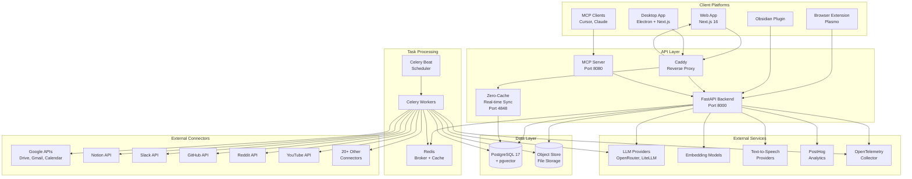

---

## 3. Technology Stack

| Layer | Technology | Version | Purpose |
|-------|-----------|---------|---------|
| **Backend** | Python | 3.11+ | Runtime |
| | FastAPI | Latest | HTTP API framework |
| | SQLAlchemy | Async | ORM with async sessions |
| | Celery | Latest | Task queue |
| | LangGraph | Latest | Multi-agent orchestration |
| | LiteLLM | Latest | LLM routing & fallback |
| | faster-whisper | Latest | Local speech-to-text (audio/video transcription) |
| | python-ffmpeg + static-ffmpeg | Latest | Audio-track extraction from video files |
| | Alembic | Latest | Database migrations |
| **Database** | PostgreSQL | 17 | Primary data store |
| | pgvector | Extension | Vector similarity search |
| | pg_trgm | Extension | Trigram text matching |
| | Redis | Latest | Broker, cache, sessions |
| **Frontend** | TypeScript | 5.8.3 | Type safety |
| | Next.js | 16.1.0 | React framework |
| | React | 19.2.3 | UI library |
| | Jotai | 2.15.1 | Client state management |
| | React Query | 5.90.7 | Server state management |
| | Rocicorp Zero | 1.6.0 | Real-time sync |
| | Tailwind CSS | Latest | Styling |
| | Radix UI | Latest | Accessible components |
| | Drizzle ORM | Latest | Zero schema types |
| | next-intl | 4.6.1 | Internationalization (6 languages) |
| **Desktop** | Electron | Latest | Desktop shell |
| | esbuild | Latest | Bundling |
| **Extension** | Plasmo | Latest | Cross-browser extension |
| **Obsidian** | Obsidian API | 1.5.4+ | Plugin framework |
| **MCP** | FastMCP SDK | ≥1.26.0 | Model Context Protocol |
| | httpx | ≥0.27.0 | Async HTTP client |
| **Eval** | scikit-learn | Latest | Metrics computation |
| | trafilatura | Latest | Web content extraction |
| | Azure Doc Intelligence | Latest | PDF processing |
| **Infra** | Docker | Latest | Containerization |
| | Docker Compose | Latest | Orchestration |
| | Caddy | Latest | Reverse proxy + HTTPS |
| | OpenTelemetry | Latest | Observability |
| | PostHog | Latest | Product analytics |

---

## 4. Component Map

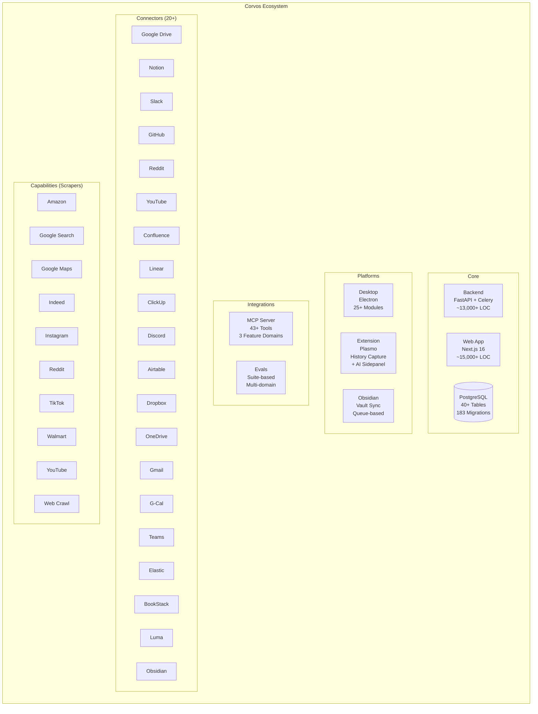

---

## 5. Data Flow Diagrams

### 5.1 Document Ingestion Pipeline

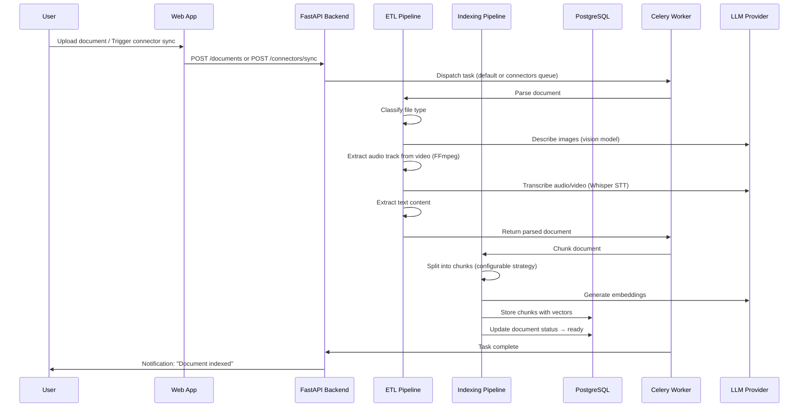

### 5.2 Chat / Agent Execution Flow

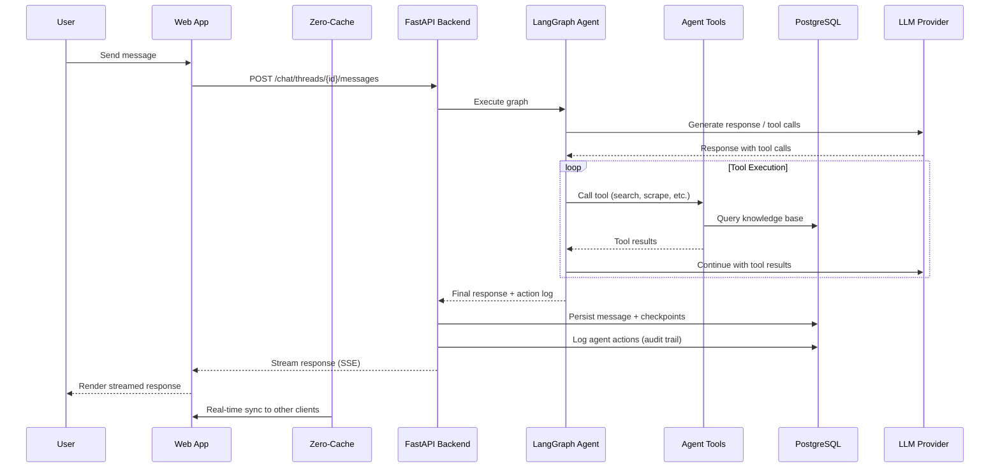

### 5.3 Connector Sync Flow

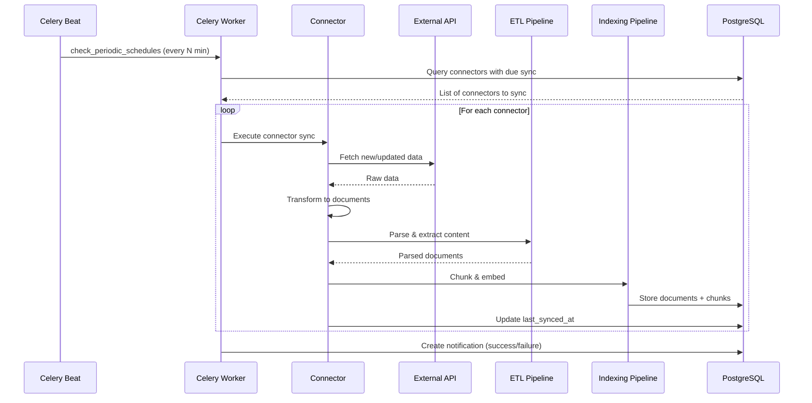

---

## 6. Backend Architecture

### 6.1 Application Lifecycle

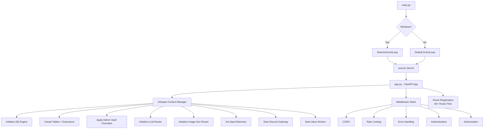

### 6.2 Module Architecture

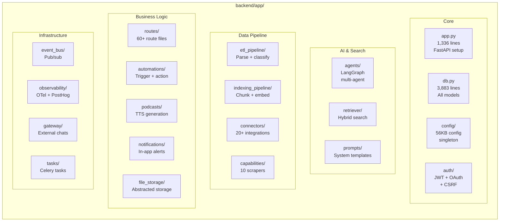

### 6.3 API Route Categories

| Category | Route Files | Key Endpoints |
|----------|------------|---------------|
| **Authentication** | auth_routes.py, users_routes.py | POST /auth/register, POST /auth/login, POST /auth/refresh |
| **Chat** | new_chat_routes.py (94KB) | POST /chat/threads, POST /chat/threads/{id}/messages (SSE stream) |
| **Documents** | documents_routes.py (69KB) | CRUD /documents, POST /documents/upload, GET /documents/{id}/chunks |
| **Connectors** | search_source_connectors_routes.py (125KB) | CRUD /connectors, POST /connectors/{id}/sync, GET /connectors/{id}/status |
| **Agent** | agent_action_log_route.py, agent_permissions_route.py, agent_revert_route.py | GET /agent/actions, POST /agent/revert, CRUD /agent/permissions |
| **Automations** | automation_routes.py | CRUD /automations, GET /automations/{id}/runs |
| **Podcasts** | podcast_routes.py | POST /podcasts/generate, GET /podcasts/{id}/audio |
| **Reports** | report_routes.py | POST /reports/generate, GET /reports/{id} |
| **Video** | video_presentation_routes.py | POST /video/generate, GET /video/{id} |
| **Image Gen** | image_generation_routes.py | POST /images/generate |
| **Billing** | stripe_routes.py, paddle_routes.py | POST /stripe/checkout, POST /paddle/webhook |
| **Admin** | admin_routes.py | GET /admin/settings, PUT /admin/settings, GET /admin/audit-log |
| **Workspaces** | workspace_routes.py | CRUD /workspaces, POST /workspaces/{id}/invite |
| **Scrapers** | scraper_routes.py | POST /scrapers/{type}/run, GET /scrapers/runs |

### 6.4 Celery Task Queue Architecture

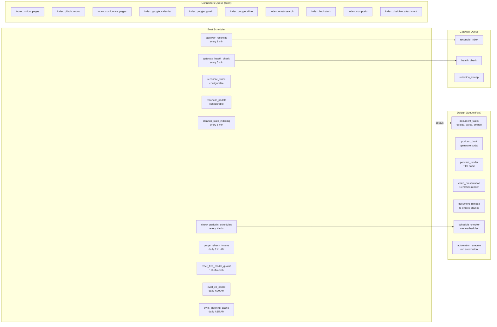

---

## 7. Database Schema

### 7.1 Entity-Relationship Diagram

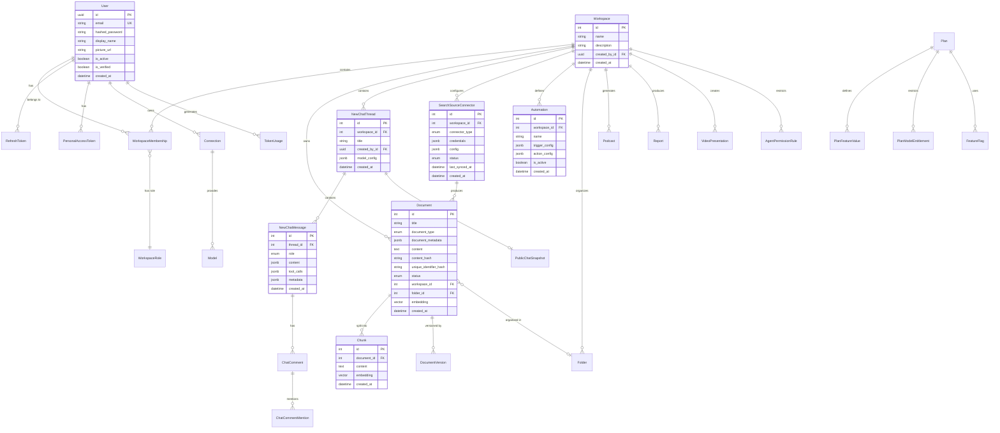

### 7.2 Complete Table Inventory

| Domain | Tables | Key Features |
|--------|--------|-------------|
| **Users & Auth** | User, OAuthAccount, RefreshToken, PersonalAccessToken | Google OAuth, JWT, PAT |
| **Workspaces & RBAC** | Workspace, WorkspaceRole, WorkspaceMembership, WorkspaceInvite, PlatformRole, PlatformRoleAssignment | Owner/Editor/Viewer, custom roles, platform admin |
| **Documents** | Document, Chunk, DocumentVersion, Folder, DocumentFile, DocumentRevision, FolderRevision | HNSW vector index, FTS index, trigram index |
| **Chat** | NewChatThread, NewChatMessage, ChatComment, ChatCommentMention, PublicChatSnapshot, TokenUsage | Rich JSONB content, streaming SSE |
| **Connectors** | SearchSourceConnector | 20+ connector types, incremental sync |
| **LLM Config** | Connection, Model, AdminLLMProvider, AdminLLMModel | Scope: GLOBAL/SEARCH_SPACE/USER |
| **Automations** | Automation, AutomationRun, AutomationTrigger | Schedule + event triggers |
| **Podcasts** | Podcast (PodcastStatus enum) | TTS generation, rendering |
| **Reports** | Report | Markdown or Typst |
| **Images** | ImageGeneration | LiteLLM aimage_generation |
| **Video** | VideoPresentation | Remotion-based |
| **Notifications** | Notification | In-app notification system |
| **Billing** | Plan, FeatureFlag, PlanFeatureValue, UserFeatureOverride, PlanModelEntitlement, CreditPurchase, PagePurchase, PaddleCustomer, PaddleSubscription, PaddleTransaction | Stripe + Paddle, unified credits |
| **Audit & Logs** | Log, AgentActionLog, AdminAuditLog | Full audit trail |
| **Scrapers** | Run, ToolOutputSpill | Capability invocations |
| **Cache** | CachedParse, CachedEmbeddingSet | ETL and indexing cache with eviction |
| **External Chat** | ExternalChatAccount, ExternalChatBinding, ExternalChatInboundEvent | Telegram, WhatsApp, Slack, Discord, Signal |
| **Quotas** | FreeModelGlobalQuota, FreeModelUserQuota | Token-based free tier |
| **Admin** | AdminSetting, AdminConnectorCredential | Vault-encrypted config overrides |

### 7.3 Database Indexes

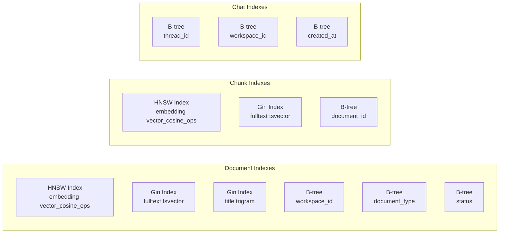

### 7.4 PostgreSQL Configuration

| Parameter | Value | Purpose |
|-----------|-------|---------|
| max_connections | 200 | Concurrent connections |
| shared_buffers | 256MB | Memory for caching |
| wal_level | logical | Required for Zero-cache replication |
| max_replication_slots | 10 | Zero-cache slots |
| max_wal_senders | 10 | Replication streams |

---

## 8. Agent System

### 8.1 Agent Architecture

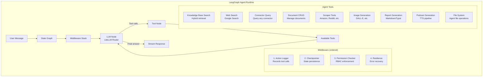

### 8.2 Agent Behavior Model

| Behavior | Implementation | Description |
|----------|---------------|-------------|
| **Tool Selection** | LLM function calling | Agent selects tools based on user intent |
| **Multi-step Reasoning** | LangGraph state machine | Iterative tool calling until answer found |
| **Action Logging** | AgentActionLog model | Every tool call recorded with input/output |
| **Reversibility** | Agent revert route | Actions can be undone (document edits, deletions) |
| **Permission Checking** | AgentPermissionRule | Workspace/user/thread-scoped restrictions |
| **Checkpointing** | LangGraph checkpointer | State saved after each node for recovery |
| **Memory** | Thread-level context | Conversation history + mentioned documents |
| **Streaming** | SSE via FastAPI | Tokens, thinking steps, tool calls streamed live |

### 8.3 Agent Permission Rules

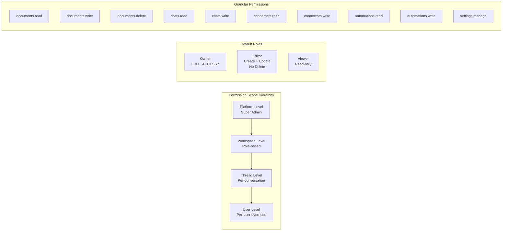

---

## 9. Connector System

### 9.1 Connector Architecture

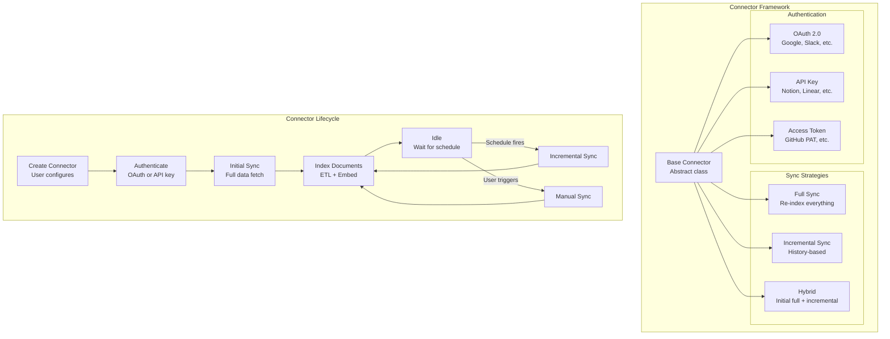

### 9.2 Complete Connector Inventory

| Connector | Type | Auth | Sync Strategy | Data Types |
|-----------|------|------|---------------|------------|
| Google Drive | Native + Composio | OAuth 2.0 | Incremental | Documents, Spreadsheets, PDFs, Slides |
| Gmail | Native + Composio | OAuth 2.0 | Incremental | Email messages, attachments |
| Google Calendar | Native + Composio | OAuth 2.0 | Incremental | Calendar events |
| Notion | Native | OAuth 2.0 | Incremental (history) | Pages, databases |
| Confluence | Native | OAuth 2.0 | Incremental (history) | Pages, spaces |
| Slack | Native | OAuth 2.0 | Incremental (history) | Messages, channels, threads |
| GitHub | Native | Access Token | Incremental | Repos, issues, PRs, wikis |
| Microsoft Teams | Native | OAuth 2.0 | Incremental | Messages, channels |
| Discord | Native | Bot Token | Incremental | Messages, channels |
| Linear | Native | API Key | Incremental | Issues, projects |
| ClickUp | Native | API Key | Incremental | Tasks, lists, spaces |
| Jira | Native | OAuth 2.0 | Incremental | Issues, projects |
| Airtable | Native | API Key | Full | Tables, records |
| Dropbox | Native | OAuth 2.0 | Incremental | Files, folders |
| OneDrive | Native | OAuth 2.0 | Incremental | Files, folders |
| Elasticsearch | Native | API Key | Incremental | Documents |
| BookStack | Native | API Key | Incremental | Pages, books |
| Luma | Native | API Key | Incremental | Events |
| Obsidian | Plugin | API Key | Queue-based | Notes, attachments |
| Local Folder | Desktop | N/A | File watcher | Local files |

### 9.3 Scraper Capabilities

| Scraper | Platform | Implementation | Output |
|---------|----------|---------------|--------|
| Amazon | amazon.com | Browser automation | Product data, reviews, prices |
| Google Search | google.com | SERP parsing | Search results, snippets |
| Google Maps | maps.google.com | Maps API + scraping | Places, reviews, ratings |
| Indeed | indeed.com | Browser automation | Job listings, descriptions |
| Instagram | instagram.com | Browser automation | Posts, profiles, stories |
| Reddit | reddit.com | Reddit API | Posts, comments, subreddits |
| TikTok | tiktok.com | Browser automation | Videos, profiles, trends |
| Walmart | walmart.com | Browser automation | Products, prices, reviews |
| YouTube | youtube.com | YouTube API | Video transcripts, metadata |
| Web Crawl | Any URL | Playwright/Patchright | Full page content |

---

## 10. ETL & Indexing Pipelines

### 10.1 ETL Pipeline

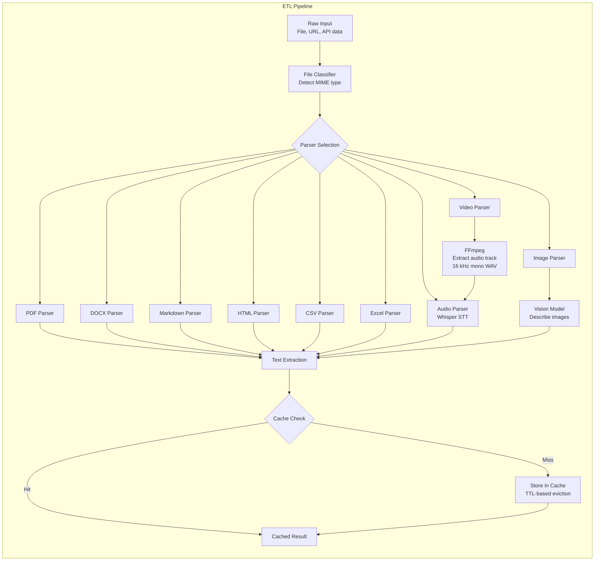

**Multimedia ingestion:** `classify_file()` routes audio files (`.mp3`, `.mp4`, `.mpeg`, `.mpga`, `.m4a`, `.wav`, `.webm`) to `parsers/audio.py` and video files (`.avi`, `.mov`, `.mkv`, `.flv`, `.wmv`, `.3gp`, `.ogv`, `.m4v`, `.mpg`, `.vob`) to `parsers/video.py`. The video parser extracts the audio track into a temporary 16 kHz mono WAV via FFmpeg (run in a worker thread, temp file deleted afterwards) and delegates to the same `transcribe_audio()` path used for audio files. Transcription is dual-path: LiteLLM `atranscription` against the configured `STT_SERVICE` (external Whisper-compatible API), or local faster-whisper when `STT_SERVICE` starts with `local/`. Both emit a `# Transcription of {filename}` markdown document that flows into the indexing pipeline, so meeting recordings and lecture videos become searchable, citable knowledge. Audio/video files are parser-agnostic - `should_skip_for_service()` never skips them regardless of the selected ETL service.

### 10.2 Indexing Pipeline

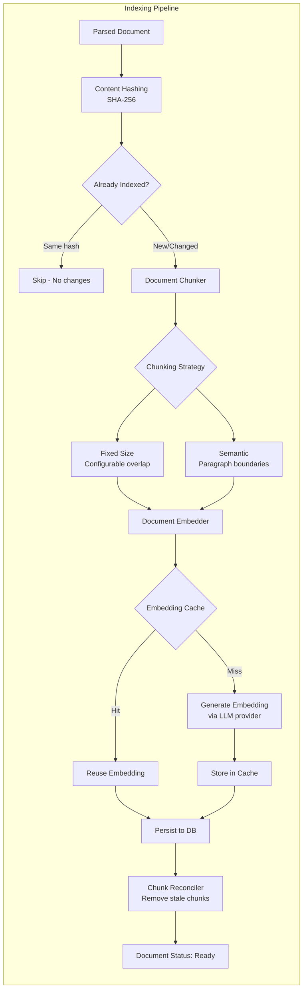

### 10.3 Hybrid Search (Retriever)

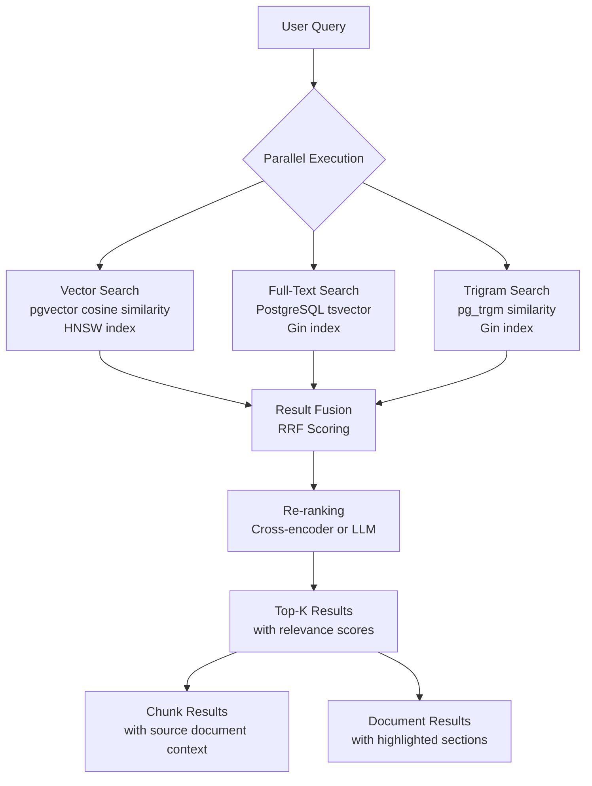

---

## 11. Web Frontend Architecture

### 11.1 Route Structure

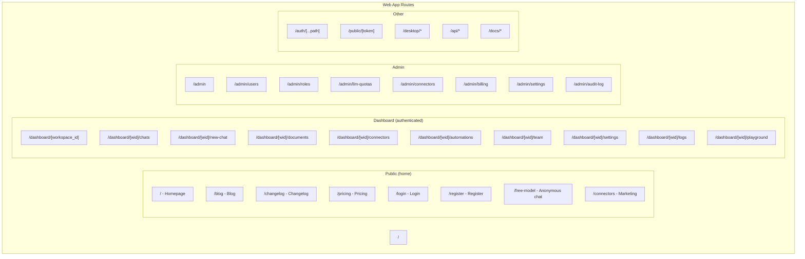

### 11.2 State Management Architecture

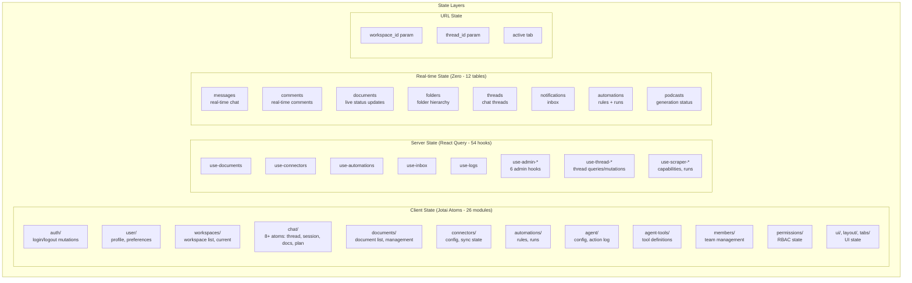

### 11.3 Component Architecture

```mermaid
graph TB
    subgraph "Component Layers"
        subgraph "UI Primitives (78+ components)"
            UI_BTN[Button]
            UI_DIALOG[Dialog]
            UI_INPUT[Input]
            UI_TABLE[Table]
            UI_SELECT[Select]
            UI_TOAST[Toast]
            UI_DROPDOWN[Dropdown]
            UI_SHEET[Sheet]
        end
        
        subgraph "Feature Components (48+ directories)"
            CHAT_UI[Chat Components<br/>message rendering, input]
            DOC_UI[Document Components<br/>upload, viewer, editor]
            CONN_UI[Connector Components<br/>config, status]
            ADMIN_UI[Admin Components<br/>settings, user mgmt]
            TOOL_UI[Tool UI (24+)<br/>agent tool displays]
            ASSISTANT_UI[Assistant UI (25+)<br/>markdown, code blocks]
            CITATION_UI[Citation Components<br/>source references]
        end
        
        subgraph "Layout Components"
            SHELL[Dashboard Shell]
            ADMIN_SHELL[Admin Shell]
            NAVBAR[Navbar]
            FOOTER[Footer]
            SIDEBAR[Sidebar]
        end
        
        subgraph "Providers"
            THEME_P[ThemeProvider]
            I18N_P[I18nProvider<br/>6 languages]
            ZERO_P[ZeroProvider<br/>real-time sync]
            RQ_P[ReactQueryProvider]
            POSTHOG_P[PostHogProvider]
            PLATFORM_P[PlatformProvider]
            ANON_P[AnonymousModeProvider]
            LOADING_P[GlobalLoadingProvider]
        end
    end
```

### 11.4 API Service Layer (37+ services)

All API services extend a `BaseApiService` class with common HTTP logic:

| Service Category | Services | Key Methods |
|-----------------|----------|-------------|
| **Auth** | auth, pats, users | login, register, refresh, createPAT |
| **Chat** | chat-threads, chat-comments, anonymous-chat | createThread, sendMessage (SSE), getComments |
| **Documents** | documents, folders | CRUD, upload, getChunks, createFolder |
| **Connectors** | connectors, google-drive | CRUD, sync, getStatus, getFolders |
| **Agents** | agent-actions, agent-permissions | getActions, revert, setPermissions |
| **Automations** | automations | CRUD, getRuns, toggleActive |
| **Artifacts** | podcasts, reports, image-generations, video-presentations | generate, getStatus, download |
| **Admin** | admin-billing, admin-connectors, admin-llm, admin-rbac, admin-settings | CRUD for admin resources |
| **Workspace** | workspaces, members, invites, roles, permissions | CRUD, invite, setRole |
| **Other** | notifications, logs, prompts, scrapers, model-connections, public-chat, stripe | Various CRUD |

### 11.5 Internationalization

| Language | Code | File |
|----------|------|------|
| English | en | messages/en.json |
| Spanish | es | messages/es.json |
| Portuguese | pt | messages/pt.json |
| Hindi | hi | messages/hi.json |
| Chinese | zh | messages/zh.json |
| Korean | ko | messages/ko.json |

---

## 12. MCP Server

### 12.1 Architecture

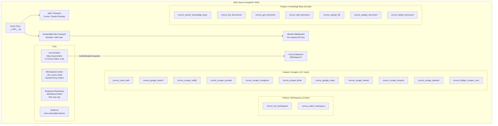

### 12.2 Tool Inventory (43+ tools)

| Domain | Tool | Description |
|--------|------|-------------|
| **Workspace** | corvos_list_workspaces | List all accessible workspaces |
| | corvos_select_workspace | Set active workspace (fuzzy match) |
| **Scrapers** | corvos_crawl_web | Crawl any URL |
| | corvos_google_search | Google search results |
| | corvos_scrape_reddit | Reddit posts/comments |
| | corvos_scrape_youtube | YouTube transcripts |
| | corvos_scrape_instagram | Instagram content |
| | corvos_scrape_tiktok | TikTok content |
| | corvos_google_maps | Maps places/reviews |
| | corvos_scrape_indeed | Job listings |
| | corvos_scrape_amazon | Product data |
| | corvos_scrape_walmart | Product data |
| | corvos_list_scraper_runs | Past scrape history |
| | corvos_get_scraper_run | Get specific scrape result |
| **Knowledge Base** | corvos_search_knowledge_base | Semantic search |
| | corvos_list_documents | List all documents |
| | corvos_get_document | Read document content |
| | corvos_add_document | Add text note |
| | corvos_upload_file | Upload PDF/doc |
| | corvos_update_document | Update document |
| | corvos_delete_document | Delete document |

### 12.3 Authentication Model

```mermaid
sequenceDiagram
    participant Client as MCP Client (Cursor/Claude)
    participant MCP as MCP Server
    participant Backend as Corvos Backend
    
    alt stdio Transport
        Client->>MCP: Tool call (env: CORVOS_API_KEY)
        MCP->>Backend: GET /api/v1/... (Authorization: Bearer {key})
        Backend-->>MCP: Response
        MCP-->>Client: Formatted result
    else HTTP Transport
        Client->>MCP: Tool call (Authorization: Bearer {key})
        MCP->>MCP: Identity middleware extracts key → contextvar
        MCP->>Backend: GET /api/v1/... (Authorization: Bearer {key})
        Backend-->>MCP: Response
        MCP->>MCP: Render (markdown/JSON), clip to 20K chars
        MCP-->>Client: Formatted result
    end
```

---

## 13. Desktop Application

### 13.1 Architecture

```mermaid
graph TB
    subgraph "Electron Desktop App"
        subgraph "Main Process"
            MAIN[main.ts<br/>App lifecycle]
            
            subgraph "Modules (25+)"
                SERVER[server.ts<br/>Embedded Next.js]
                WINDOW[window.ts<br/>Main window]
                TRAY[tray.ts<br/>System tray]
                AUTO_UPDATER[auto-updater.ts<br/>GitHub releases]
                AUTO_LAUNCH[auto-launch.ts<br/>OS startup]
                FOLDER_WATCH[folder-watcher.ts<br/>File system events]
                AGENT_FS[agent-filesystem.ts<br/>Agent file tree]
                QUICK_ASK[quick-ask.ts<br/>Global shortcut]
                MENU[menu.ts<br/>App menu]
                ANALYTICS[analytics.ts<br/>PostHog]
                DEEP_LINKS[deep-links.ts<br/>corvos:// URLs]
                OAUTH[oauth.ts<br/>Auth flow]
                SCREEN[screen-capture/<br/>Screen grab]
                SECRET[secret-store.ts<br/>Credential storage]
                SHORTCUTS[shortcuts.ts<br/>Keyboard shortcuts]
                PERMISSIONS[permissions.ts<br/>macOS ACL]
                ACTIVE_WS[active-workspace.ts<br/>Current workspace]
                PLATFORM[platform.ts<br/>OS detection]
                ERRORS[errors.ts<br/>Error handling]
            end
            
            IPC[IPC Handlers<br/>handlers.ts]
        end
        
        subgraph "Renderer Process"
            NEXT[Embedded Next.js<br/>Full web app]
        end
        
        subgraph "Preload Bridge"
            PRELOAD[preload.ts<br/>contextBridge]
            API[electronAPI<br/>24 IPC channels]
        end
        
        MAIN --> IPC
        IPC <--> |ipcRenderer/ipcMain| PRELOAD
        PRELOAD --> API
        API --> NEXT
        SERVER --> NEXT
    end
```

### 13.2 IPC Channel Map

| Channel | Direction | Purpose |
|---------|-----------|---------|
| auth:get-token | Renderer → Main | Get stored auth token |
| auth:set-token | Renderer → Main | Store auth token |
| auth:clear | Renderer → Main | Clear all auth data |
| folder:start-watching | Renderer → Main | Begin file system watch |
| folder:stop-watching | Renderer → Main | Stop file system watch |
| folder:select | Renderer → Main | Open folder picker dialog |
| agent-fs:watch | Renderer → Main | Watch agent file tree |
| agent-fs:read | Renderer → Main | Read agent file contents |
| analytics:track | Renderer → Main | Track analytics event |
| permissions:request | Renderer → Main | Request macOS permissions |
| quick-ask:register | Renderer → Main | Register global shortcut |
| screen:capture | Renderer → Main | Capture screen region |
| auto-launch:get | Renderer → Main | Get auto-launch state |
| auto-launch:set | Renderer → Main | Set auto-launch preference |

### 13.3 Desktop Lifecycle

```mermaid
sequenceDiagram
    participant OS
    participant Main as Main Process
    participant Tray as System Tray
    participant Next as Next.js Server
    participant Window as Browser Window

    OS->>Main: app.launch
    Main->>Main: Register error handlers
    Main->>Main: Setup deep links (corvos://)
    Main->>Main: Register IPC handlers
    Main->>Main: app.whenReady()
    Main->>Main: initAnalytics()
    Main->>Main: purgeLegacyAuthCutover()
    Main->>Next: startNextServer()
    Next-->>Main: Server ready
    Main->>Tray: createTray()
    Main->>Main: applyAutoLaunchDefaults()
    
    alt Not hidden at login
        Main->>Window: createMainWindow('/dashboard')
    else Hidden at login (stays in tray)
        Note over Main: Window created lazily on tray click
    end
    
    Main->>Main: registerQuickAsk()
    Main->>Main: registerFolderWatcher()
    Main->>Main: setupAutoUpdater()
    Main->>Main: handlePendingDeepLink()
    
    Note over Main: App stays alive in tray when window closed
    
    OS->>Main: will-quit event
    Main->>Main: unregisterQuickAsk()
    Main->>Main: unregisterFolderWatcher()
    Main->>Next: stopNextServer()
    Main->>Tray: destroyTray()
    Main->>Main: shutdownAnalytics()
    Main->>OS: app.exit()
```

---

## 14. Browser Extension

### 14.1 Architecture

```mermaid
graph TB
    subgraph "Browser Extension (Plasmo)"
        subgraph "Background Service Worker"
            BG[background/index.ts]
            
            BG --> TAB_EVENTS[Tab Lifecycle<br/>onCreated, onUpdated, onRemoved]
            BG --> CONTENT_EXEC[Execute Content Script<br/>Capture rendered HTML]
            BG --> STORAGE[Local Storage<br/>URL queues, time queues]
            BG --> MESSAGES[Message Handlers<br/>savedata.ts, savesnapshot.ts]
            BG --> AUTO_CAPTURE[Researcher Mode<br/>auto_capture toggle<br/>Page → markdown → KB]
            BG --> CONTEXT_MENUS[Context Menus<br/>Save page / selection<br/>Ask Corvos → sidepanel]
        end
        
        subgraph "Content Script"
            CS[content.ts<br/>Injected on ALL URLs<br/>MAIN world]
            CS --> CAPTURE[getRenderedHtml()<br/>document.outerHTML]
        end
        
        subgraph "Popup UI"
            POPUP[popup.tsx<br/>React Router]
            POPUP --> HOME[HomePage<br/>Status, stats<br/>Researcher-mode toggle]
            POPUP --> APIKEY[ApiKeyForm<br/>Backend URL + key]
            POPUP --> LOADING[Loading State]
        end
        
        subgraph "Sidepanel (AI Chat)"
            SIDE[sidepanel.tsx<br/>Chat with page context]
            SIDE --> PAGE_CTX[utils/page-context.ts<br/>Active tab → semantic markdown<br/>20k char cap]
            SIDE --> API_CLIENT[utils/corvos-api.ts<br/>PAT auth + SSE streaming]
        end
        
        subgraph "Data Flow"
            TAB[Tab opened/updated] --> BG
            BG --> CS
            CS --> |HTML + URL + timestamp| BG
            BG --> STORAGE
            STORAGE --> |Batch send| BACKEND[Corvos Backend<br/>/api/v1/documents]
            SIDE --> |Chat turns + page context| BACKEND
        end
    end
```

### 14.2 Permissions

| Permission | Purpose |
|-----------|---------|
| storage | Store URL queues, API keys, config |
| scripting | Execute content scripts |
| unlimitedStorage | Handle large browsing history |
| activeTab | Access current tab content |
| sidePanel | AI chat sidepanel ("Ask Corvos about this page") |
| contextMenus | Right-click: save page / save selection / ask AI |
| host_permissions (all URLs) | Capture history from any site |

### 14.3 Data Capture Flow

```mermaid
sequenceDiagram
    participant User
    participant Tab as Browser Tab
    participant BG as Background Script
    participant CS as Content Script
    participant Storage as Chrome Storage
    participant Backend as Corvos Backend

    User->>Tab: Navigate to page
    Tab->>BG: tabs.onUpdated (complete)
    BG->>BG: initQueues(tabId)
    BG->>BG: initWebHistory(tabId)
    BG->>CS: Execute content script
    CS->>CS: getRenderedHtml()
    CS-->>BG: {url, title, entryTime, renderedHtml}
    BG->>Storage: Append to urlQueueList
    BG->>Storage: Append to timeQueueList
    
    Note over BG,Storage: Periodic batch sync
    
    BG->>Backend: POST /api/v1/documents<br/>(type: EXTENSION)
    Backend-->>BG: Acknowledgment
    BG->>Storage: Clear synced items
```

### 14.4 Sidepanel AI Chat & Researcher Mode

```mermaid
sequenceDiagram
    participant User
    participant BG as Background Worker
    participant SP as Sidepanel
    participant Tab as Active Tab
    participant Backend as Corvos Backend

    Note over User,BG: Entry point
    User->>BG: Right-click → "Ask Corvos about this page"
    BG->>BG: storage.set("ask_with_context", true)
    BG->>SP: chrome.sidePanel.open({ windowId })

    Note over SP,Backend: Chat turn
    SP->>SP: Boot: verify PAT → workspaces → threads
    SP->>Tab: captureActiveTabMarkdown() (page-context.ts)
    Tab-->>SP: { url, title, markdown } - capped at 20k chars
    User->>SP: Question (include page context toggle)
    SP->>Backend: POST /api/v1/threads (create if needed)
    SP->>Backend: POST /api/v1/new_chat - query wraps page in<br/>&lt;current_web_page_context&gt; block + question
    Backend-->>SP: SSE: text-delta / reasoning-delta / start-step
    SP-->>User: Streamed answer (agent may use workspace RAG)

    Note over User,Backend: Explicit save (sidepanel button / context menu)
    SP->>Backend: POST /api/v1/documents (document_type=EXTENSION)

    Note over User,BG: Researcher mode (auto-capture)
    User->>SP: Toggle auto_capture in popup HomePage
    User->>Tab: Browse the web normally
    Tab->>BG: tabs.onUpdated (status=complete)
    BG->>BG: Rendered HTML → semantic markdown
    BG->>Backend: POST /api/v1/documents (document_type=EXTENSION)
    Note over BG,Backend: Every capturable page becomes indexed knowledge
```

Key behaviors:

- **Page context is turn-scoped**: the captured markdown is wrapped in a `<current_web_page_context>` XML block inside the user query - nothing is persisted to the knowledge base unless the user explicitly saves the page.
- **Researcher mode** is a one-click toggle in the popup HomePage (`auto_capture` in chrome.storage.local): once enabled, every completed page load on an `http(s)://` URL is captured, converted to semantic markdown (dom-to-semantic-markdown), and posted to the selected workspace. Per-URL dedup in the service worker prevents duplicate captures within a session.
- **Context menus**: `corvos-save-page` (capture the current page now), `corvos-save-selection` (save highlighted text as a mini-document), `corvos-ask-page` (open the sidepanel with page context pre-armed).
- **Auth**: all calls use the user's Personal Access Token (PAT) as a Bearer token, the same principal the popup uses for `/verify-token`.

---

## 15. Obsidian Plugin

### 15.1 Architecture

```mermaid
graph TB
    subgraph "Obsidian Plugin (corvos-obsidian)"
        MAIN_TS[main.ts<br/>Plugin Entry]
        
        MAIN_TS --> API_CLIENT[api-client.ts<br/>Corvos Backend Client<br/>Obsidian requestUrl]
        MAIN_TS --> SYNC_ENGINE[sync-engine.ts<br/>Sync Orchestrator]
        MAIN_TS --> QUEUE[queue.ts<br/>Persistent Queue<br/>Retry logic]
        MAIN_TS --> SETTINGS[settings.ts<br/>Plugin Settings Tab]
        MAIN_TS --> STATUS[status-bar.ts<br/>status-modal.ts<br/>status-visuals.ts]
        
        SYNC_ENGINE --> PAYLOAD[payload.ts<br/>Note Payload Builder]
        SYNC_ENGINE --> EXCLUDES[excludes.ts<br/>Folder/Pattern Exclusion]
        SYNC_ENGINE --> IDENTITY[vault-identity.ts<br/>Vault UUID + Fingerprint]
        
        MAIN_TS --> VAULT_EVENTS[Vault Event Listeners]
        VAULT_EVENTS --> CREATE[create → enqueue upsert]
        VAULT_EVENTS --> MODIFY[modify → enqueue upsert (debounced)]
        VAULT_EVENTS --> DELETE_1[delete → enqueue delete]
        VAULT_EVENTS --> RENAME[rename → enqueue rename]
        VAULT_EVENTS --> META[metadata-changed → enqueue upsert]
        
        MAIN_TS --> COMMANDS[Registered Commands]
        COMMANDS --> CMD1[resync-vault]
        COMMANDS --> CMD2[sync-current-note]
        COMMANDS --> CMD3[open-status]
        COMMANDS --> CMD4[open-settings]
    end
```

### 15.2 Sync Flow

```mermaid
graph TD
    START[Plugin Load] --> INIT[Init API Client + Queue + Sync Engine]
    INIT --> CONNECT[Connect to Server<br/>Health check]
    CONNECT --> |Success| DRAIN[Drain Queue<br/>Process pending items]
    CONNECT --> |Failure| STATUS_ERR[Status: Disconnected<br/>Retry with backoff]
    
    DRAIN --> RECONCILE[Reconcile<br/>Diff local vault vs server manifest]
    RECONCILE --> |Missing files| ENQUEUE_UP[Enqueue upserts]
    RECONCILE --> |Deleted files| ENQUEUE_DEL[Enqueue deletes]
    RECONCILE --> |No diff| IDLE[Idle<br/>Wait for events]
    
    ENQUEUE_UP --> DRAIN
    ENQUEUE_DEL --> DRAIN
    
    IDLE --> |File event| ENQUEUE_EVENT[Enqueue operation]
    ENQUEUE_EVENT --> FLUSH[Flush Queue<br/>Batch API calls]
    FLUSH --> IDLE
    
    IDLE --> |Timer| MAYBE_RECONCILE{Idle streak?}
    MAYBE_RECONCILE --> |Yes| BACKOFF[Adaptive Backoff<br/>2x → 8x interval]
    MAYBE_RECONCILE --> |No| RECONCILE
    BACKOFF --> RECONCILE
```

### 15.3 Error Classification

| Error Type | Trigger | Behavior |
|-----------|---------|---------|
| AuthError | 401/403 response | Status: Auth failed, prompt re-login |
| TransientError | Network timeout, 5xx | Retry with exponential backoff |
| PermanentError | 4xx (not auth) | Log error, skip item |
| VaultNotRegisteredError | No workspace selected | Prompt user to configure |

---

## 16. Evaluation Framework

### 16.1 Architecture

```mermaid
graph TB
    subgraph "Evals Framework"
        subgraph "Core"
            AUTH[Authentication<br/>Corvos API auth]
            CLIENT[Client<br/>HTTP client]
            CONFIG[Configuration<br/>Settings + ingested]
            METRICS[Metrics<br/>Accuracy, adjusted accuracy]
            PARSER_ANS[Answer Parser<br/>Letter, citations, freeform]
            PARSER_SSE[SSE Parser<br/>Stream parsing]
            PDF_RENDER[PDF Renderer<br/>ReportLab]
            VISION[Vision LLM<br/>Image understanding]
            PROVIDER[Providers<br/>OpenRouter]
            REGISTRY[Registry<br/>Suite registration]
        end
        
        subgraph "Suites (Domain-specific)"
            CRAG[CRAg<br/>Medical RAG]
            FRAMES[FRAMES<br/>Fact retrieval]
            MMLONGBENCH[MMLongBench<br/>Long-context]
            MORE_SUITES[Additional suites<br/>Legal, Finance, Code...]
        end
        
        subgraph "Scripts (15 tools)"
            RETRY[retry_failed_questions<br/>Exponential backoff]
            ANALYZE[analyze_failures<br/>Pattern analysis]
            COMPUTE[compute_adjusted_accuracy<br/>Statistical metrics]
            SUMMARISE[summarise_crag_run<br/>Run summary]
            PATCH[patch_manifest<br/>Parallel ingest]
        end
        
        subgraph "Tests"
            T_CORE[Core tests<br/>Auth, client, config, metrics, parsing]
            T_SUITES[Suite tests<br/>CRAg, FRAMES, MMLongBench graders]
        end
    end
```

### 16.2 Evaluation Pipeline

```mermaid
sequenceDiagram
    participant Script as Eval Script
    participant Harness as Eval Harness
    participant Corvos as Corvos API
    participant LLM as LLM Provider
    participant Grader as Answer Grader

    Script->>Harness: Load dataset (CRAg/FRAMES/etc.)
    Harness->>Corvos: Authenticate + create session
    
    loop For each question
        Harness->>Corvos: POST question (SSE stream)
        Corvos-->>Harness: Streamed response
        Harness->>Harness: Parse SSE → extract answer
        
        alt Letter grading
            Harness->>Grader: Compare answer letter
        else Citation extraction
            Harness->>Grader: Verify cited sources
        else Freeform
            Harness->>LLM: Judge answer quality
            LLM-->>Grader: Quality score
        end
        
        Grader-->>Harness: Score + reasoning
    end
    
    Harness->>Harness: Compute aggregate metrics
    Harness->>Script: Results (accuracy, disagreement, failures)
    Script->>Script: Generate PDF report (ReportLab)
```

### 16.3 Metrics

| Metric | Description | Formula |
|--------|-------------|---------|
| **Accuracy** | Correct answers / Total questions | correct / total |
| **Adjusted Accuracy** | Accuracy after removing statistical noise | weighted_correct / weighted_total |
| **Disagreement Rate** | Cases where grader disagrees with expected | disagreements / graded |
| **Citation Precision** | Correctly cited sources / Total cited | correct_citations / total_citations |
| **Citation Recall** | Correctly cited sources / Expected sources | correct_citations / expected_citations |

---

## 17. Infrastructure & Deployment

### 17.1 Docker Compose Architecture

```mermaid
graph TB
    subgraph "Docker Compose Stack"
        subgraph "Data Layer"
            PG[db<br/>PostgreSQL 17<br/>+ pgvector + pg_trgm<br/>Volume: postgres_data]
            REDIS[redis<br/>Redis<br/>Volume: redis_data]
        end
        
        subgraph "Migration"
            MIG[migrations<br/>Alembic upgrade head<br/>Short-lived, exits 0]
        end
        
        subgraph "Application Layer"
            BACKEND[backend<br/>FastAPI :8000<br/>Health: /health]
            CELERY_W[celery_worker<br/>Default + Connectors queues]
            CELERY_B[celery_beat<br/>Scheduler]
            ZERO[zero-cache<br/>Rocicorp Zero :4848<br/>Logical replication]
            FRONTEND[frontend<br/>Next.js :3000]
        end
        
        subgraph "Proxy Layer"
            CADDY[proxy<br/>Caddy<br/>Auto HTTPS]
        end
        
        subgraph "Observability (dev only)"
            OTEL_LGTM[otel-lgtm<br/>Grafana LGTM stack]
            PGADMIN[pgadmin<br/>DB management UI]
        end
    end
    
    PG --> MIG
    REDIS --> MIG
    MIG --> BACKEND
    PG --> BACKEND
    REDIS --> BACKEND
    BACKEND --> CELERY_W
    BACKEND --> CELERY_B
    REDIS --> CELERY_W
    PG --> CELERY_W
    PG --> ZERO
    BACKEND --> FRONTEND
    ZERO --> FRONTEND
    BACKEND --> CADDY
    FRONTEND --> CADDY
    ZERO --> CADDY
```

### 17.2 Service Dependencies

```mermaid
graph LR
    DB[db: healthy] --> MIG[migrations]
    REDIS_D[redis: healthy] --> MIG
    MIG[migrations: completed] --> BACKEND[backend]
    DB --> BACKEND
    REDIS_D --> BACKEND
    BACKEND[backend: healthy] --> CELERY_W[celery_worker]
    BACKEND --> CELERY_B[celery_beat]
    REDIS_D --> CELERY_W
    MIG --> ZERO[zero-cache]
    BACKEND --> FRONTEND[frontend]
    ZERO[zero-cache: healthy] --> FRONTEND
    FRONTEND --> CADDY[proxy]
    BACKEND --> CADDY
    ZERO --> CADDY
```

### 17.3 Caddy Routing Rules

| Path Pattern | Target | Notes |
|-------------|--------|-------|
| `/auth/*` | backend:8000 | Authentication endpoints |
| `/users/*` | backend:8000 | User management |
| `/api/v1/*` | backend:8000 | REST API |
| `/zero/*` | zero-cache:4848 | Real-time sync |
| `/*` | frontend:3000 | Next.js app (default) |

**Special Configuration:**
- Request body limit: 5GB (for large file uploads)
- `flush_interval -1`: Enables streaming responses (SSE)
- ACME HTTPS with automatic certificate management
- Trusted proxy headers for correct client IP

### 17.4 Environment Variables (Key Categories)

| Category | Variables | Description |
|----------|-----------|-------------|
| **Database** | DATABASE_URL, DB_HOST, DB_PORT, DB_NAME, DB_USER, DB_PASSWORD | PostgreSQL connection |
| **Redis** | REDIS_URL, CELERY_BROKER_URL, CELERY_RESULT_BACKEND | Redis connection |
| **Auth** | AUTH_TYPE, GOOGLE_CLIENT_ID, GOOGLE_CLIENT_SECRET, JWT_SECRET | Authentication |
| **LLM** | OPENROUTER_API_KEY, OPENAI_API_KEY, ANTHROPIC_API_KEY, LITELLM_* | LLM providers |
| **Connectors** | GOOGLE_*_KEY, NOTION_CLIENT_*, SLACK_BOT_TOKEN, GITHUB_TOKEN, etc. | Per-connector credentials |
| **Storage** | FILE_STORAGE_BACKEND, S3_BUCKET, S3_REGION | File storage |
| **Observability** | OTEL_ENDPOINT, POSTHOG_KEY, GRAFANA_* | Monitoring |
| **Billing** | STRIPE_SECRET_KEY, PADDLE_API_KEY | Payment processing |
| **Zero** | ZERO_UPSTREAM_DB, ZERO_CVR_DB, ZERO_CHANGE_DB | Real-time sync |

### 17.5 OpenTelemetry Architecture

```mermaid
graph LR
    subgraph "Instrumented Services"
        API_OTEL[Backend<br/>OTel SDK]
        CELERY_OTEL[Celery Workers<br/>OTel SDK]
        WEB_OTEL[Frontend<br/>OTel SDK]
    end
    
    subgraph "Collector"
        RECEIVER[OTLP Receiver<br/>gRPC :4317<br/>HTTP :4318]
        PROCESSOR[Processor<br/>Memory Limiter<br/>Attribute Scrubber<br/>Tail Sampler]
        EXPORTER[Exporter<br/>Grafana Cloud<br/>Batch + Retry]
    end
    
    API_OTEL --> RECEIVER
    CELERY_OTEL --> RECEIVER
    WEB_OTEL --> RECEIVER
    
    RECEIVER --> PROCESSOR
    PROCESSOR --> EXPORTER
```

**Sampling Strategy:**
- 100% of errors
- 100% of slow requests (>500ms)
- Probabilistic sampling for remaining traffic

**Attribute Scrubbing:**
- Removes Authorization headers
- Removes DB statement content
- Preserves trace/span correlation

---

## 18. Security Model

### 18.1 Authentication Flow

```mermaid
sequenceDiagram
    participant User
    participant WebApp
    participant API
    participant DB

    alt Email/Password
        User->>WebApp: Login form
        WebApp->>API: POST /auth/login
        API->>DB: Verify credentials
        DB-->>API: User record
        API-->>WebApp: JWT access + refresh tokens
    else Google OAuth
        User->>WebApp: Click "Sign in with Google"
        WebApp->>API: Redirect to OAuth
        API->>API: Google OAuth flow
        API->>DB: Create/link account
        API-->>WebApp: JWT tokens
    end
    
    WebApp->>WebApp: Store tokens (cookies + localStorage)
    WebApp->>API: API request (Authorization: Bearer {token})
    API->>API: Validate JWT
    API-->>WebApp: Protected resource
    
    Note over WebApp,API: Token refresh
    WebApp->>API: POST /auth/refresh
    API-->>WebApp: New access token
```

### 18.2 Security Controls

| Control | Implementation |
|---------|---------------|
| **JWT Tokens** | Short-lived access tokens + refresh tokens |
| **CSRF Protection** | Double-submit cookie pattern |
| **Rate Limiting** | Per-IP and per-user rate limits |
| **RBAC** | Workspace-level roles with granular permissions |
| **Agent Permissions** | Per-thread, per-user agent tool restrictions |
| **Input Validation** | Zod schemas (frontend) + Pydantic (backend) |
| **SQL Injection** | SQLAlchemy ORM (parameterized queries) |
| **XSS Protection** | React's built-in escaping + CSP headers |
| **File Upload** | Type validation, size limits (5GB), virus scanning ready |
| **Secret Management** | Admin vault with encrypted storage |
| **Audit Trail** | AdminAuditLog, AgentActionLog for all mutations |
| **CORS** | Configurable allowed origins |

### 18.3 RBAC Permission Matrix

| Permission | Owner | Editor | Viewer |
|-----------|-------|--------|--------|
| documents.read | ✅ | ✅ | ✅ |
| documents.write | ✅ | ✅ | ❌ |
| documents.delete | ✅ | ❌ | ❌ |
| chats.read | ✅ | ✅ | ✅ |
| chats.write | ✅ | ✅ | ❌ |
| connectors.read | ✅ | ✅ | ✅ |
| connectors.write | ✅ | ✅ | ❌ |
| automations.read | ✅ | ✅ | ✅ |
| automations.write | ✅ | ✅ | ❌ |
| settings.manage | ✅ | ❌ | ❌ |
| members.manage | ✅ | ❌ | ❌ |
| billing.manage | ✅ | ❌ | ❌ |

---

## 19. Test Strategy

### 19.1 Test Pyramid

```mermaid
graph TB
    subgraph "Test Pyramid"
        E2E["E2E Tests (Playwright)<br/>web/tests/<br/>Full user journeys<br/>10+ connector specs"]
        
        INTEGRATION["Integration Tests<br/>backend/tests/integration/<br/>API + DB + connector flows<br/>Per-connector test suites"]
        
        UNIT["Unit Tests<br/>backend/tests/unit/<br/>Pure logic tests<br/>Parsing, matching, transforms"]
        
        EVAL["Evaluation Tests<br/>evals/tests/<br/>LLM quality metrics<br/>Suite-specific graders"]
        
        MCP_TEST["MCP Tests<br/>mcp/tests/<br/>Tool registration, auth<br/>8+ test files"]
    end
    
    E2E --> INTEGRATION
    INTEGRATION --> UNIT
    EVAL --> UNIT
    MCP_TEST --> UNIT
```

### 19.2 E2E Test Architecture

```mermaid
graph TB
    subgraph "Playwright E2E Suite"
        subgraph "Setup"
            AUTH_SETUP[auth.setup.ts<br/>Acquire test token<br/>Pre-seed localStorage]
            FIXTURES[Fixtures<br/>workspace, chat-thread<br/>14+ connector fixtures]
        end
        
        subgraph "Helpers"
            CANARY[canary.ts<br/>Deterministic test data<br/>Per-connector canary tokens]
            API_HELP[API helpers<br/>Auth, chat, generic]
            UI_HELP[UI helpers<br/>Interaction helpers]
            WAIT_HELP[Wait helpers<br/>Polling utilities]
        end
        
        subgraph "Test Specs"
            SMOKE[Smoke Tests<br/>dashboard.spec.ts<br/>chat-stream.spec.ts]
            
            subgraph "Connector Tests (10+)"
                CT_GOOGLE[Google Drive]
                CT_NOTION[Notion]
                CT_CONFLUENCE[Confluence]
                CT_LINEAR[Linear]
                CT_JIRA[Jira]
                CT_SLACK[Slack]
                CT_CLICKUP[ClickUp]
                CT_ONEDRIVE[OneDrive]
                CT_DROPBOX[Dropbox]
                CT_COMPOSIO[Composio variants]
            end
            
            DOC_TESTS[Document Tests]
        end
    end
```

### 19.3 Test Case Categories

| Category | Test Type | Count | Description |
|----------|-----------|-------|-------------|
| **Smoke** | E2E | 2 | Dashboard loads, chat streams |
| **Connector Journeys** | E2E | 10+ | Connect → Index → Assert canary content |
| **Document Operations** | E2E | 3+ | Upload, view, search, delete |
| **Auth Flow** | Integration | 5+ | Login, register, OAuth, refresh |
| **RBAC** | Integration | 10+ | Role enforcement per endpoint |
| **Agent Actions** | Integration | 5+ | Tool calls, permissions, revert |
| **ETL Pipeline** | Unit | 10+ | Parser correctness per format |
| **Indexing** | Unit | 5+ | Chunking, embedding, reconciliation |
| **Search** | Unit | 5+ | Hybrid search ranking |
| **MCP Tools** | Unit | 8+ | Tool registration, auth, rendering |
| **Eval Graders** | Unit | 5+ | Letter, citation, freeform grading |

### 19.4 Canary Token Strategy

Each connector has a unique canary token embedded in fake data to prove end-to-end indexing:

| Connector | Canary Token |
|-----------|-------------|
| Google Drive | CORVOS_E2E_CANARY_TOKEN_DRIVE_001 |
| Gmail | CORVOS_E2E_CANARY_TOKEN_GMAIL_001 |
| Calendar | CORVOS_E2E_CANARY_TOKEN_CALENDAR_001 |
| OneDrive | CORVOS_E2E_CANARY_TOKEN_ONEDRIVE_001 |
| Dropbox | CORVOS_E2E_CANARY_TOKEN_DROPBOX_001 |
| Notion | CORVOS_E2E_CANARY_TOKEN_NOTION_001 |
| Confluence | CORVOS_E2E_CANARY_TOKEN_CONFLUENCE_001 |
| Linear | CORVOS_E2E_CANARY_TOKEN_LINEAR_001 |
| Jira | CORVOS_E2E_CANARY_TOKEN_JIRA_001 |
| Slack | CORVOS_E2E_CANARY_TOKEN_SLACK_001 |
| ClickUp | CORVOS_E2E_CANARY_TOKEN_CLICKUP_001 |
| Manual Upload (MD) | E2E-MANUAL-UPLOAD-MD-CANARY-7f3a |
| Manual Upload (PDF) | E2E-MANUAL-UPLOAD-PDF-CANARY-9d2b |

---

## 20. Use Cases & User Journeys

### 20.1 Primary Use Cases

```mermaid
graph TB
    subgraph "Use Case Map"
        UC1["UC1: Knowledge Base Building<br/>Upload docs + connect sources<br/>→ Searchable corpus"]
        UC2["UC2: AI-Assisted Research<br/>Chat with knowledge base<br/>→ Cited answers with sources"]
        UC3["UC3: Automated Reports<br/>Select sources + topic<br/>→ Generated research report"]
        UC4["UC4: Podcast Generation<br/>Select documents<br/>→ Audio podcast with TTS"]
        UC5["UC5: Video Presentations<br/>Select content<br/>→ Remotion video with slides"]
        UC6["UC6: Web Scraping<br/>Define scrape target<br/>→ Structured data extraction"]
        UC7["UC7: Team Collaboration<br/>Invite members, set roles<br/>→ Shared workspace"]
        UC8["UC8: Automation Workflows<br/>Define triggers + actions<br/>→ Automated data processing"]
        UC9["UC9: MCP Integration<br/>Connect Cursor/Claude<br/>→ AI agents use Corvos tools"]
        UC10["UC10: Browsing History Capture<br/>Install extension<br/>→ Automatic knowledge capture"]
        UC11["UC11: Obsidian Vault Sync<br/>Install plugin<br/>→ Notes synced to knowledge base"]
        UC12["UC12: Admin Management<br/>Configure LLM providers, quotas<br/>→ Platform governance"]
        UC13["UC13: Multimedia Ingestion<br/>Upload meeting video/audio<br/>→ Transcribed searchable knowledge"]
        UC14["UC14: Ask AI About Current Page<br/>Extension sidepanel<br/>→ Chat with page context"]
    end
```

### 20.2 User Journey: Research Workflow

```mermaid
sequenceDiagram
    participant Researcher
    participant Corvos
    
    Note over Researcher,Corvos: Phase 1: Setup
    Researcher->>Corvos: Create workspace "AI Research"
    Researcher->>Corvos: Connect Google Drive (OAuth)
    Researcher->>Corvos: Connect Notion (API key)
    Researcher->>Corvos: Connect Reddit connector
    Corvos->>Corvos: Initial sync all sources
    Corvos-->>Researcher: "3 sources connected, 247 documents indexed"
    
    Note over Researcher,Corvos: Phase 2: Research
    Researcher->>Corvos: "What are the latest trends in AI agents?"
    Corvos->>Corvos: Hybrid search (vector + FTS)
    Corvos->>Corvos: Agent reasons over results
    Corvos->>Corvos: Agent calls Reddit scraper for latest posts
    Corvos-->>Researcher: Cited answer with 12 sources
    
    Note over Researcher,Corvos: Phase 3: Deliverable
    Researcher->>Corvos: "Generate a report on AI agent trends"
    Corvos->>Corvos: Compile sources + analysis
    Corvos-->>Researcher: Markdown report with citations
    
    Note over Researcher,Corvos: Phase 4: Share
    Researcher->>Corvos: Share chat publicly
    Corvos-->>Researcher: Public URL generated
    Researcher->>Corvos: Invite colleague as Editor
    Corvos-->>Researcher: Invitation sent
```

### 20.3 User Journey: Developer using MCP

```mermaid
sequenceDiagram
    participant Dev as Developer
    participant Cursor as Cursor IDE
    participant MCP as Corvos MCP Server
    participant Backend as Corvos Backend
    
    Dev->>Cursor: "Search my knowledge base for auth patterns"
    Cursor->>MCP: corvos_search_knowledge_base("auth patterns")
    MCP->>MCP: Resolve workspace from context
    MCP->>Backend: GET /api/v1/search?q=auth+patterns
    Backend-->>MCP: 5 relevant documents
    MCP-->>Cursor: Formatted results (markdown, clipped)
    
    Dev->>Cursor: "Get the full auth document"
    Cursor->>MCP: corvos_get_document(id=42)
    MCP->>Backend: GET /api/v1/documents/42
    Backend-->>MCP: Full document content
    MCP-->>Cursor: Document content
    
    Dev->>Cursor: "Scrape Reddit for recent auth discussions"
    Cursor->>MCP: corvos_scrape_reddit(query="authentication best practices")
    MCP->>Backend: POST /api/v1/scrapers/reddit
    Backend-->>MCP: Scraped results
    MCP-->>Cursor: Reddit posts formatted
```

---

## Appendix A: File Statistics

| Component | Files | Lines (approx.) | Key Files |
|-----------|-------|-----------------|-----------|
| **Backend** | 200+ | 50,000+ | db.py (3,883), app.py (1,336), config (56KB) |
| **Web Frontend** | 400+ | 60,000+ | 60+ route files, 78+ UI components, 54 hooks |
| **MCP Server** | 25+ | 2,500+ | server.py, 3 feature modules |
| **Desktop** | 30+ | 3,000+ | main.ts, 25+ modules |
| **Browser Extension** | 15+ | 800+ | background, content, popup |
| **Obsidian Plugin** | 14 | 2,500+ | sync-engine.ts, api-client.ts |
| **Evals** | 30+ | 5,000+ | Suite-based framework |
| **Docker** | 10+ | 500+ | 7 compose files |
| **Migrations** | 183 | 15,000+ | Schema evolution |
| **Total** | 700+ | 139,000+ | |

---

## Appendix B: Configuration Files

| File | Purpose |
|------|---------|
| `backend/pyproject.toml` | Python dependencies, project metadata |
| `backend/alembic.ini` | Alembic migration configuration |
| `backend/.env.example` | Environment variable template |
| `web/package.json` | Node.js dependencies, scripts |
| `web/next.config.ts` | Next.js configuration |
| `web/tailwind.config.js` | Tailwind CSS theming |
| `web/tsconfig.json` | TypeScript configuration |
| `web/drizzle.config.ts` | Drizzle ORM (Zero schema) |
| `web/biome.json` | Biome linter/formatter |
| `web/playwright.config.ts` | E2E test configuration |
| `desktop/package.json` | Electron app dependencies |
| `desktop/electron-builder.yml` | Electron build configuration |
| `browser_extension/package.json` | Extension dependencies |
| `browser_extension/biome.json` | Extension linter |
| `mcp/pyproject.toml` | MCP server dependencies |
| `mcp/Dockerfile` | MCP container build |
| `obsidian/manifest.json` | Obsidian plugin manifest |
| `obsidian/package.json` | Plugin dependencies |
| `evals/pyproject.toml` | Eval framework dependencies |
| `docker/docker-compose.yml` | Production stack |
| `docker/docker-compose.dev.yml` | Development stack |
| `docker/postgresql.conf` | PostgreSQL tuning |
| `docker/proxy/Caddyfile` | Reverse proxy rules |
| `docker/otel-collector/config.yaml` | OTel collector config |

---

## Appendix C: Build & Run Commands

```bash
# ─── Full Stack (Docker) ───
cd docker
cp .env.example .env
docker compose up -d

# ─── Backend (Development) ───
cd backend
uv sync
uv run alembic upgrade head
uv run main.py

# ─── Celery Worker ───
cd backend
uv run python celery_worker.py worker --loglevel=info -Q default,default.connectors

# ─── Celery Beat ───
cd backend
uv run python celery_worker.py beat --loglevel=info

# ─── Web Frontend ───
cd web
pnpm install
pnpm dev

# ─── MCP Server (stdio) ───
cd mcp
uv sync
CORVOS_API_KEY=your_key uv run corvos-mcp

# ─── MCP Server (HTTP) ───
cd mcp
CORVOS_TRANSPORT=streamable-http CORVOS_API_KEY=your_key uv run corvos-mcp

# ─── Desktop ───
cd desktop
pnpm install
pnpm dev

# ─── Browser Extension ───
cd browser_extension
pnpm install
pnpm dev

# ─── Obsidian Plugin ───
cd obsidian
npm install
npm run dev

# ─── Evals ───
cd evals
uv sync
uv run corvos-evals

# ─── E2E Tests ───
cd web
pnpm exec playwright install --with-deps chromium
pnpm test:e2e
```

---

## 21. Voice Agent System (ElevenLabs)

### 21.1 Architecture Overview

```mermaid
graph TB
    subgraph "Web Frontend (Chat Composer)"
        MIC_BTN[Mic Button<br/>Push-to-Talk<br/>VoiceRecordingButton]
        PHONE_BTN[Phone Button<br/>Continuous Call<br/>VoiceCallPanel + VAD]
        SETTINGS_BTN[AudioLines Button<br/>Voice/Accent/Language<br/>VoiceSettingsPopover]
        ATOM[voice-settings.atom<br/>localStorage persistence]
        SETTINGS_BTN --> ATOM
    end

    subgraph "Voice Agent Pipeline"
        USER_AUDIO[User Audio<br/>webm/opus] --> STT[Speech-to-Text<br/>ElevenLabs Scribe<br/>or faster-whisper]
        
        STT --> TRANSCRIPTION[Transcription<br/>text + language]
        TRANSCRIPTION --> AGENT[Chat Agent<br/>LangGraph or<br/>ElevenLabs Conversational AI]
        
        AGENT --> REPLY[Reply Text<br/>concise, conversational<br/>user's language]
        REPLY --> TTS[Text-to-Speech<br/>ElevenLabs Multilingual v2<br/>selected accent voice]
        
        TTS --> REPLY_AUDIO[Reply Audio<br/>MP3 bytes]
    end
    
    MIC_BTN -->|audio + voice_id + language| USER_AUDIO
    PHONE_BTN -->|auto-loop turns| USER_AUDIO
    
    subgraph "API Endpoints"
        EP_AGENT[POST /voice/agent<br/>Full STT→Chat→TTS turn]
        EP_TTS[POST /voice/tts<br/>Text → Audio]
        EP_STT[POST /voice/stt<br/>Audio → Text]
        EP_VOICES[GET /voice/voices<br/>Built-in catalog voices]
        EP_LIBRARY[GET /voice/library<br/>Accent voices from<br/>ElevenLabs Voice Library]
        EP_LANGS[GET /voice/languages<br/>30 conversation languages]
    end
    
    subgraph "TTS Providers"
        KOKORO[Kokoro<br/>Local, free]
        OPENAI_TTS[OpenAI<br/>6 voices]
        ELEVENLABS[ElevenLabs<br/>Catalog 15 + Library accents<br/>29 languages]
        AZURE_TTS[Azure]
        VERTEX_TTS[Vertex AI]
    end
```

### 21.2 Voice Agent Flow

```mermaid
sequenceDiagram
    participant Client as Web/Desktop (mic or call mode)
    participant API as Voice API
    participant STT as STT Service
    participant Agent as Chat Agent
    participant TTS as ElevenLabs TTS

    Client->>API: POST /voice/agent (audio + workspace_id + voice_id + language)
    API->>STT: Transcribe audio (language_hint)
    STT-->>API: {text: "تازہ ترین AI رجحانات کیا ہیں؟", language: "ur"}
    
    alt ElevenLabs Conversational AI configured
        API->>Agent: ElevenLabs Conversational AI
        Agent-->>API: Voice-optimised response
    else Standard Corvos Agent
        API->>Agent: Corvos multi-agent chat (prompt: reply in "ur")
        Agent-->>API: Urdu reply, concise & conversational
    end
    
    API->>TTS: Synthesise reply with selected accent voice
    TTS-->>API: MP3 audio bytes
    
    API-->>Client: Response(audio, X-Voice-Transcription, X-Voice-Reply-Text, X-Voice-Language)
    Client->>Client: Auto-play reply; call mode re-opens mic (auto-loop)
```

### 21.3 Frontend Voice UI

The chat composer exposes three voice controls, all mounted in `ComposerAction` (`web/components/assistant-ui/thread.tsx`) next to the send button:

```mermaid
graph TB
    subgraph "Chat Composer (thread.tsx ComposerAction)"
        MIC[VoiceRecordingButton<br/>Mic icon - Push-to-Talk]
        PHONE[VoiceCallPanel<br/>Phone icon - Continuous Call]
        SETTINGS[VoiceSettingsPopover<br/>AudioLines icon - Voice & Language]
    end

    subgraph "Hooks"
        REC[use-voice-recording.ts<br/>Single-turn lifecycle]
        CALL[use-voice-call.ts<br/>Call loop + Web Audio VAD]
    end

    subgraph "API Client"
        SVC[voice-api.service.ts<br/>multipart → blob + headers<br/>401 refresh-retry]
    end

    subgraph "Persisted State"
        ATOM[voice-settings.atom.ts<br/>localStorage: voice-settings:v1<br/>voiceId + voiceName + language]
    end

    MIC --> REC
    PHONE --> CALL
    REC -->|reads voiceId/language| ATOM
    CALL -->|reads voiceId/language| ATOM
    REC --> SVC
    CALL --> SVC
    SVC -->|POST /voice/agent| BE[Backend Voice API]
```

| Component | File | Purpose |
|-----------|------|---------|
| `VoiceRecordingButton` | `web/components/assistant-ui/voice-recording-button.tsx` | Push-to-talk: click to record, click again to stop & send, right-click to cancel. Shows state (idle/recording pulse/processing spinner/playing) and auto-plays the reply |
| `VoiceCallPanel` | `web/components/assistant-ui/voice-call-panel.tsx` | Phone-call mode: start button, connecting pill, active-call pill with live timer, turn indicator (Listening/You're speaking/Thinking/Agent speaking/Muted), send-now, mute, and hang-up controls |
| `VoiceSettingsPopover` | `web/components/assistant-ui/voice-settings-popover.tsx` | Voice & language picker: language Select (30 languages + auto-detect), Voice Library tab grouped by accent, Default tab for catalog voices, per-voice preview playback, reset-to-defaults |
| `use-voice-recording` | `web/hooks/use-voice-recording.ts` | Single-turn hook: `idle → requesting_mic → recording → processing → playing → idle`. MediaRecorder (opus/webm, 250 ms chunks), 400 ms minimum clip, AbortController per request |
| `use-voice-call` | `web/hooks/use-voice-call.ts` | Continuous-call hook: persistent MediaStream + reused AudioContext/AnalyserNode, VAD-driven turn-taking, auto-loop after reply playback, mute/pause, send-now |
| `voiceApiService` | `web/lib/apis/voice-api.service.ts` | Raw-fetch client for `POST /voice/agent` (FormData in → MP3 blob + `X-Voice-*` header metadata out) with session-refresh retry; also STT/TTS/library/languages methods |
| `voiceSettingsAtom` | `web/atoms/voice/voice-settings.atom.ts` | `atomWithStorage` persistence of `{ voiceId, voiceName, language }` - selections survive reloads and apply to both mic and call modes |

### 21.4 Voice Call Mode (Phone-Call Experience)

A hands-free, continuous conversation: the user clicks once, talks naturally, and the system detects turn boundaries automatically.

```mermaid
stateDiagram-v2
    [*] --> Idle
    Idle --> Connecting : Click phone icon
    Connecting --> Active : Mic permission granted
    Connecting --> Idle : Mic denied (toast)

    state Active {
        [*] --> Listening
        Listening --> Speaking : RMS > 0.015
        Speaking --> Processing : 1.5 s continuous silence
        Listening --> Processing : Send-now pressed
        Processing --> AgentSpeaking : Reply audio ready
        AgentSpeaking --> Listening : Audio ended → auto-loop
        Processing --> Listening : Turn error (stay in call)
        Listening --> Paused : Mute
        Paused --> Listening : Unmute
    }

    Active --> Ended : Hang up
    Ended --> Idle : after 1 s
```

**Voice Activity Detection (VAD)** runs on a Web Audio `AnalyserNode` (fftSize 256, smoothing 0.3), polled every 60 ms for RMS volume:

| Constant | Value | Purpose |
|----------|-------|---------|
| `SILENCE_THRESHOLD` | 0.015 RMS | Volume below this counts as silence |
| `SILENCE_DURATION` | 1.5 s | Continuous silence after speech → auto-send the turn |
| `MIN_RECORDING_MS` | 400 ms | Shorter clips are discarded (mic pops / ambient noise) |
| `VAD_INTERVAL_MS` | 60 ms | Analyser polling rate |
| Chunk interval | 250 ms | `MediaRecorder.start(250)` for smooth stop |

Implementation notes:

- The `MediaStream` stays open for the whole call, so there is zero re-permission latency between turns.
- One `MediaRecorder` per turn; the reply plays through a single `HTMLAudioElement`; after `onended` the mic re-opens after a 200 ms settle delay.
- Muting stops and **discards** the in-progress recording and playback; unmuting resumes listening.
- A failed turn (network/5xx) shows a toast and re-opens the mic - the call never drops mid-conversation.
- Hang-up aborts any in-flight request, stops recorder/playback/stream, and closes the `AudioContext`.

### 21.5 Voice Settings: Accents & Multi-Language Support

#### 21.5.1 Two Voice Sources

| Source | Endpoint | Contents | Preview |
|--------|----------|----------|---------|
| **Default catalog** | `GET /voice/voices` | 15 built-in ElevenLabs voices (10 multilingual + 5 English-optimised) from `backend/app/podcasts/voices/data/elevenlabs.py` | Synthesised on demand via `POST /voice/tts` and cached per page lifetime |
| **Voice Library** | `GET /voice/library` | The deployment's ElevenLabs voice library, including community voices carrying **accent labels** - Indian, Pakistani, Chinese, American, British, African, Australian, and every other accent in the ElevenLabs Voice Library | Free hosted preview MP3 URL per voice |

Library voices are grouped by accent in the UI ("INDIAN ACCENT", "PAKISTANI ACCENT", …), searchable by accent/language/description, and any voice added to the ElevenLabs account appears in Corvos automatically - no code changes needed. Catalog IDs are prefixed (`elevenlabs:<id>`); the backend strips the prefix before calling the API, so both ID forms are accepted everywhere.

#### 21.5.2 Multi-Language Flow

```mermaid
sequenceDiagram
    participant UI as VoiceSettingsPopover
    participant Atom as voice-settings.atom (localStorage)
    participant Hook as use-voice-recording / use-voice-call
    participant API as POST /voice/agent
    participant STT as Scribe / Whisper
    participant LLM as Chat Agent
    participant TTS as ElevenLabs v2

    UI->>Atom: {voiceId: "<library voice>", language: "ur"}
    UI->>Hook: settings apply from next turn (optsRef)
    Hook->>API: audio + voice_id + language=ur
    API->>STT: transcribe(language_hint="ur")
    STT-->>API: Urdu text (higher accuracy with hint)
    API->>LLM: system prompt enforces "reply in ur"
    LLM-->>API: Urdu reply, concise & spoken-style
    API->>TTS: synthesise(reply, selected accent voice, language)
    TTS-->>API: MP3 spoken in the selected accent
    API-->>Hook: audio + X-Voice-Transcription + X-Voice-Reply-Text
```

With `language: null` (Auto-detect), Scribe detects the spoken language, the agent mirrors it in the reply, and TTS renders it - the user can mix languages freely. With an explicit language, the STT hint boosts accuracy, the system prompt pins the reply language, and TTS renders in that language.

#### 21.5.3 Supported Languages (30)

| Region | Languages (code) |
|--------|------------------|
| South Asian | Hindi (`hi`), Urdu (`ur`), Bengali (`bn`), Punjabi (`pa`), Tamil (`ta`), Telugu (`te`), Marathi (`mr`), Gujarati (`gu`), Kannada (`kn`), Malayalam (`ml`) |
| English & European | English (`en`), Spanish (`es`), French (`fr`), German (`de`), Italian (`it`), Portuguese (`pt`), Dutch (`nl`), Polish (`pl`), Swedish (`sv`), Ukrainian (`uk`), Russian (`ru`) |
| Middle East & Africa | Arabic (`ar`), Persian (`fa`), Turkish (`tr`) |
| East & Southeast Asian | Chinese (`zh`), Japanese (`ja`), Korean (`ko`), Vietnamese (`vi`), Thai (`th`), Indonesian (`id`), Filipino (`fil`) |

STT (Scribe) covers ~99 languages; the multilingual v2 TTS model covers 29. The curated list in `SUPPORTED_LANGUAGES` (`backend/app/routes/voice_agent_routes.py`) is the intersection both sides handle well, plus the most-requested locales.

### 21.6 File Inventory

**Backend:**

| File | Purpose |
|------|--------|
| `backend/app/agents/voice_agent/__init__.py` | Module exports |
| `backend/app/agents/voice_agent/service.py` | Voice agent orchestrator (STT→Chat→TTS), language-aware prompt, voice-ID prefix stripping |
| `backend/app/agents/voice_agent/stt.py` | Speech-to-text service (ElevenLabs Scribe + Whisper) |
| `backend/app/podcasts/tts/adapters/elevenlabs.py` | ElevenLabs TTS adapter |
| `backend/app/podcasts/voices/data/elevenlabs.py` | ElevenLabs voice roster (15 voices) |
| `backend/app/podcasts/voices/provider.py` | TtsProvider.ELEVENLABS enum |
| `backend/app/podcasts/tts/factory.py` | ElevenLabs factory branch |
| `backend/app/podcasts/voices/catalog.py` | Catalog includes ElevenLabs voices |
| `backend/app/routes/voice_agent_routes.py` | REST endpoints: agent/tts/stt/voices/library/languages (incl. `SUPPORTED_LANGUAGES`) |
| `backend/app/config/__init__.py` | ELEVENLABS_* config vars |

**Frontend:**

| File | Purpose |
|------|--------|
| `web/components/assistant-ui/voice-recording-button.tsx` | Push-to-talk mic button with state visuals |
| `web/components/assistant-ui/voice-call-panel.tsx` | Phone-call UI (timer, turn indicator, mute, hang-up) |
| `web/components/assistant-ui/voice-settings-popover.tsx` | Voice/accent + language picker with previews |
| `web/hooks/use-voice-recording.ts` | Single-turn recording lifecycle hook |
| `web/hooks/use-voice-call.ts` | Continuous call hook with VAD auto-loop |
| `web/lib/apis/voice-api.service.ts` | Voice API client (multipart→blob, header metadata, refresh-retry) |
| `web/atoms/voice/voice-settings.atom.ts` | Persisted voice settings (voiceId, voiceName, language) |
| `web/components/assistant-ui/thread.tsx` | Composer mounts all three voice controls |

### 21.7 Configuration

| Variable | Default | Description |
|----------|---------|-------------|
| `ELEVENLABS_API_KEY` | - | ElevenLabs API key (required) |
| `ELEVENLABS_MODEL` | `eleven_multilingual_v2` | TTS model (29 languages) |
| `ELEVENLABS_VOICE_ID` | `pNInz6obpgDQGcFmaJgB` | Default voice (Adam) |
| `ELEVENLABS_VOICE_AGENT_ID` | - | Conversational AI agent ID (optional) |
| `ELEVENLABS_STT_MODEL` | `scribe_v1` | STT model |
| `TTS_SERVICE` | `local/kokoro` | Set to `elevenlabs` for ElevenLabs TTS |

### 21.8 Available ElevenLabs Voices

| Voice | Gender | Language | Use Case |
|-------|--------|----------|----------|
| Adam | Male | Multilingual | Default, authoritative narration |
| Rachel | Female | Multilingual | Warm, professional |
| Bella | Female | Multilingual | Friendly, conversational |
| Antoni | Male | Multilingual | Deep, authoritative |
| Domi | Female | Multilingual | Energetic, youthful |
| Elli | Female | Multilingual | Calm, clear |
| Josh | Male | Multilingual | Casual, friendly |
| Arnold | Male | Multilingual | Strong, commanding |
| Daniel | Male | Multilingual | Professional, warm |
| Sam | Male | Multilingual | Neutral, versatile |
| Charlie | Male | English | Natural, conversational |
| Matilda | Female | English | Clear, professional |
| Harry | Male | English | Casual, engaging |
| Gigi | Female | English | Bright, youthful |
| James | Male | English | Formal, authoritative |

Beyond this catalog, every voice in the account's ElevenLabs Voice Library - including all accent voices (Indian, Pakistani, Chinese, American, British, …) - is selectable via `GET /voice/library`.

---

*This blueprint represents the complete architectural specification of Corvos v1.0, sufficient for any development agent to reconstruct the entire system from scratch.*
