# Corvos - Subagent Behavior & Implementation Specification

> Detailed behavioral specifications for all AI agents, scraper systems, automation engines, and model interactions.

---

## Table of Contents

1. [Agent System Architecture](#1-agent-system-architecture)
2. [Chat Agent Behavior Model](#2-chat-agent-behavior-model)
3. [Video Presentation Agent](#3-video-presentation-agent)
4. [Podcast Generation Agent](#4-podcast-generation-agent)
5. [Scraper/Capability System](#5-scraper-capability-system)
6. [Automation Engine](#6-automation-engine)
7. [Event Bus System](#7-event-bus-system)
8. [Model Behavior Specifications](#8-model-behavior-specifications)
9. [Prompt Engineering](#9-prompt-engineering)
10. [Tool Definitions](#10-tool-definitions)
11. [Voice Agent Behavior](#11-voice-agent-behavior)

---

## 1. Agent System Architecture

### 1.1 LangGraph-Based Multi-Agent System

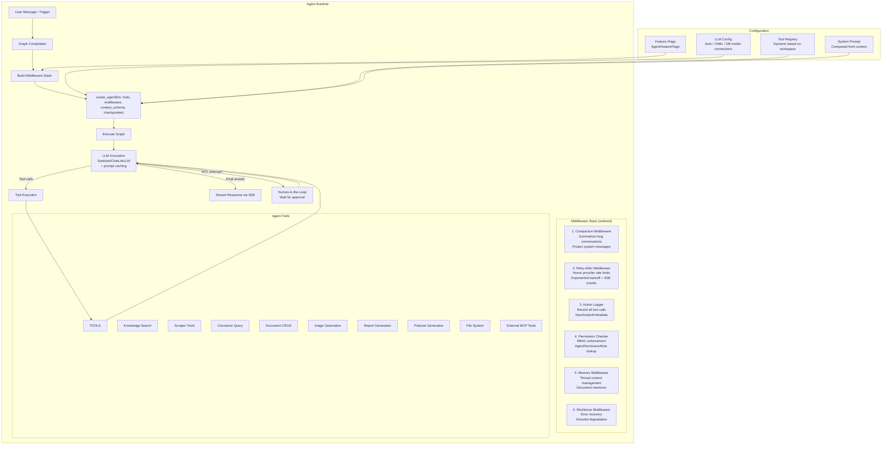

### 1.2 Graph Compilation Details

| Parameter | Value | Description |
|-----------|-------|-------------|
| `recursion_limit` | 10,000 | Maximum graph iterations per run |
| `context_schema` | CorvosContextSchema | Typed context for workspace/user state |
| `checkpointer` | AsyncPostgresSaver | PostgreSQL-backed state persistence |
| `metadata` | deepagents version | Integration tracking |

### 1.3 LLM Configuration Resolution

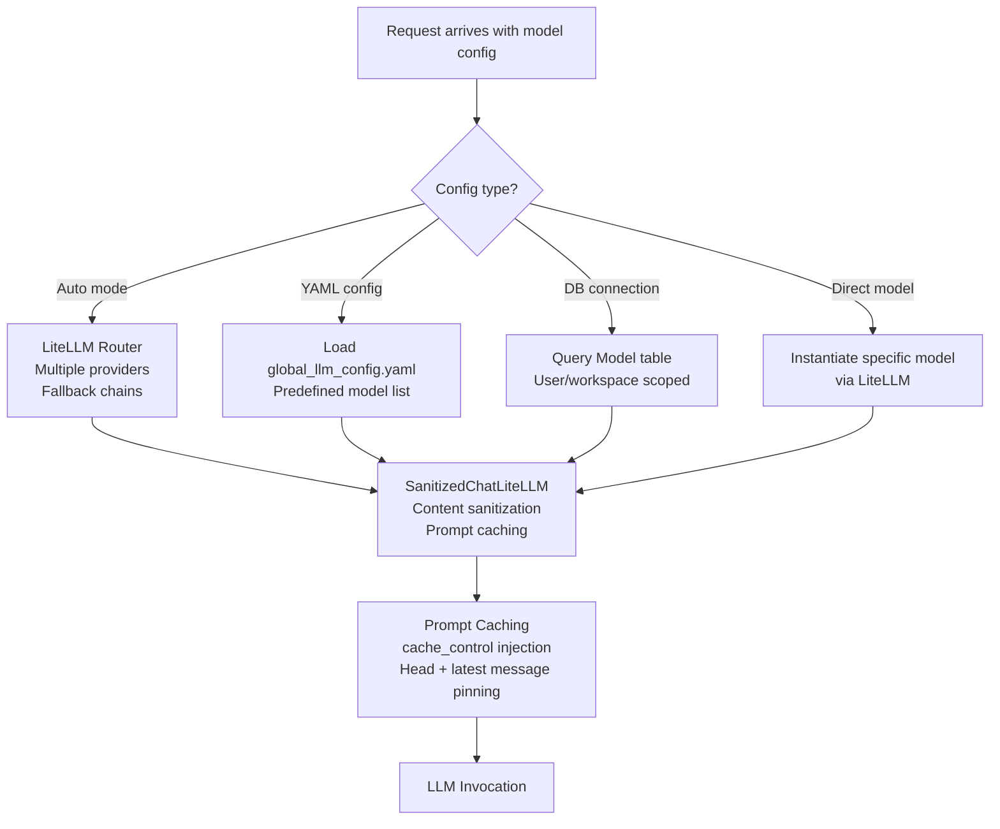

### 1.4 Error Taxonomy

| Error Code | Type | Recovery Strategy |
|-----------|------|-------------------|
| `rate_limit` | Retryable | Retry-After middleware with exponential backoff |
| `auth` | Terminal | Return error, prompt re-authentication |
| `context_overflow` | Retryable | Compaction middleware summarizes older messages |
| `permission_denied` | Terminal | Log attempt, return permission error |
| `model_not_found` | Terminal | Return error with available models list |
| `network_error` | Retryable | Retry with backoff |
| `timeout` | Retryable | Retry once, then fail |

---

## 2. Chat Agent Behavior Model

### 2.1 Agent Decision Flow

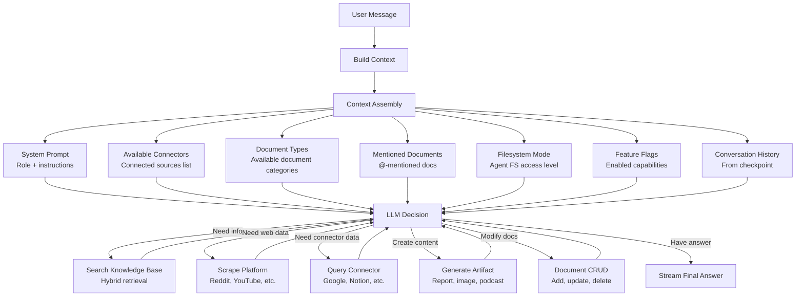

### 2.2 Tool Selection Logic

The LLM decides which tools to call based on:

1. **System Prompt Instructions**: The system prompt defines the agent's role, capabilities, and tool usage guidelines
2. **Available Tool Descriptions**: Each tool has a detailed description that guides the LLM on when to use it
3. **User Intent**: The LLM analyzes the user's query to determine the appropriate action
4. **Context**: Available connectors, mentioned documents, and conversation history inform the decision

**Tool Selection Heuristics (embedded in prompt):**

| User Intent | Tool Selection |
|------------|----------------|
| "What does my knowledge base say about X?" | Search Knowledge Base |
| "Search the web for X" | Google Search scraper |
| "What are people saying on Reddit about X?" | Reddit scraper |
| "Find recent YouTube videos about X" | YouTube scraper |
| "Check my Notion for X" | Notion connector query |
| "Generate a report on X" | Report generation tool |
| "Create an image of X" | Image generation tool |
| "Add a note about X" | Document creation tool |
| "Summarize document X" | Document retrieval + LLM reasoning |

### 2.3 Streaming Protocol (SSE)

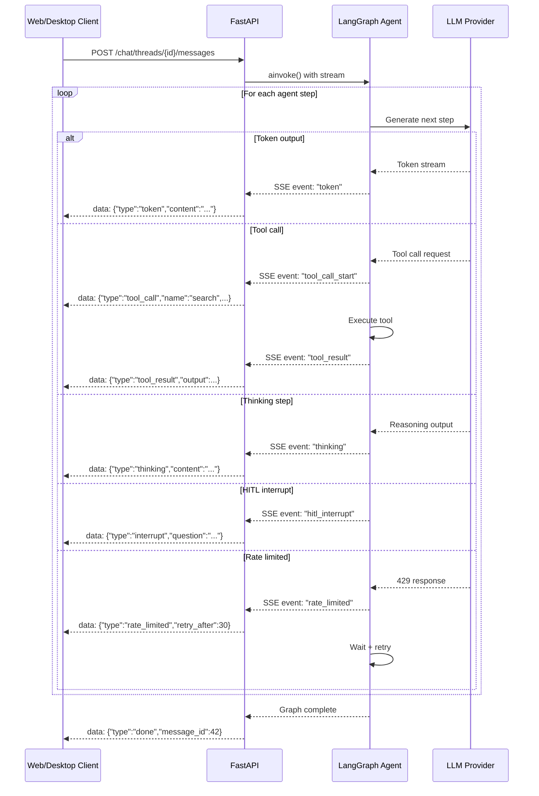

> **Client contract:** Every chat client consumes the same SSE stream from `POST /api/v1/new_chat` - the web app (`web/lib/chat/streaming-state.ts`), the desktop app, and the browser extension sidepanel (`browser_extension/utils/corvos-api.ts`, which parses `data: {...}` lines and filters by `type`). Emitted event types include `text-delta`, `reasoning-delta`, `reasoning-end`, `start-step`, `finish-step`, and `error`; clients must ignore event types they don't handle. The extension sidepanel additionally prefixes its user queries with a `<current_web_page_context>` block so the agent can reason over the page the user is viewing.

### 2.4 Checkpointing & State Persistence

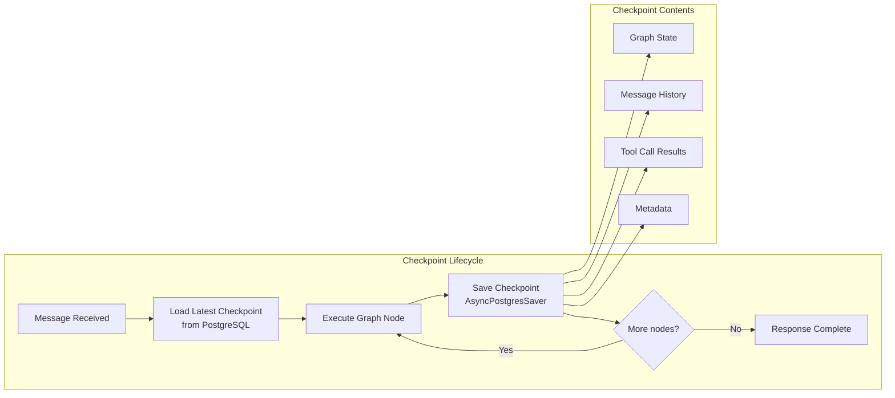

### 2.5 Conversation Compaction

When conversation history exceeds `max_input_tokens`:

1. **System messages are protected** - never summarized or removed
2. **Recent messages are preserved** - last N messages kept intact
3. **Older messages are summarized** - LLM generates a concise summary
4. **Summary replaces old messages** - keeps context window manageable

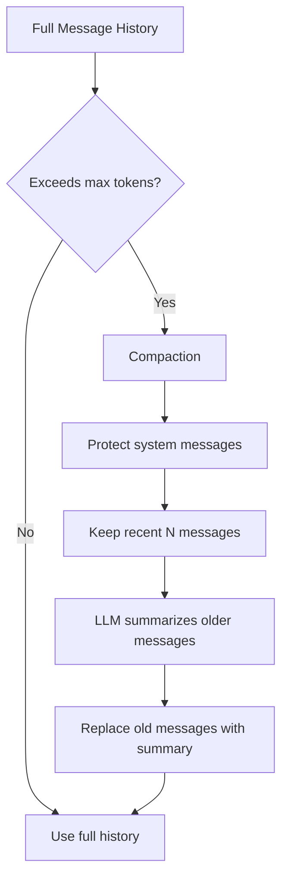

---

## 3. Video Presentation Agent

### 3.1 State Graph Definition

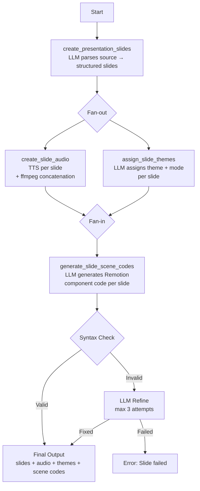

### 3.2 Node Specifications

| Node | Input | Output | LLM Usage |
|------|-------|--------|-----------|
| `create_presentation_slides` | source_content, user_prompt | List of SlideContent | Parse content → JSON structured slides |
| `create_slide_audio` | slides | SlideAudioResult[] | No LLM (TTS only) |
| `assign_slide_themes` | slides | {slide_number: (theme, mode)} | Assign visual theme per slide |
| `generate_slide_scene_codes` | slides, audio_results, themes | SlideSceneCode[] | Generate Remotion React component |

### 3.3 Slide Content Schema

```typescript
interface SlideContent {
  slide_number: number;
  title: string;
  subtitle?: string;
  content_in_markdown: string;
  background_explanation?: string;
  speaker_transcripts: string[];  // TTS input per segment
}

interface SlideAudioResult {
  slide_number: number;
  audio_file: string;
  duration_seconds: number;
  duration_in_frames: number;  // at 30 FPS
}

interface SlideSceneCode {
  slide_number: number;
  code: string;       // Remotion React component
  title: string;
}
```

### 3.4 Theme Presets

The system includes predefined visual themes that the LLM assigns to slides:

| Theme | Style | Use Case |
|-------|-------|----------|
| MINIMAL | Clean, whitespace-heavy | General content |
| CORPORATE | Professional, structured | Business presentations |
| CREATIVE | Bold colors, dynamic | Marketing content |
| TECHNICAL | Code-focused, monospace | Developer content |
| ACADEMIC | Formal, citation-heavy | Research presentations |

Each theme supports `dark` and `light` modes.

### 3.5 Code Validation & Auto-Repair

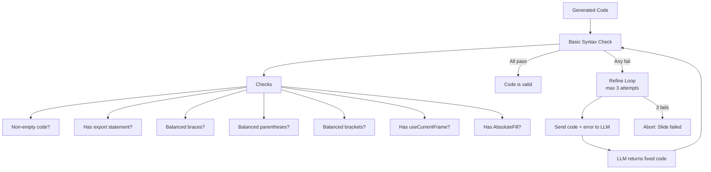

---

## 4. Podcast Generation Agent

### 4.1 Generation Pipeline

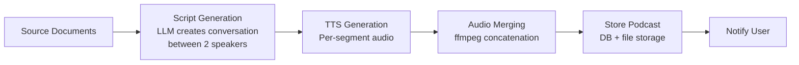

### 4.2 TTS Provider Support

| Provider | Model | Features |
|----------|-------|----------|
| OpenAI | tts-1, tts-1-hd | Multiple voices, high quality |
| ElevenLabs | Various | Premium voices, cloning |
| Kokoro (Local) | local/kokoro | Self-hosted, no API costs |

### 4.3 Voice Assignment

```python
# Voice selection based on provider and speaker
voice = get_voice_for_provider(
    tts_service,        # "openai", "elevenlabs", or "local/kokoro"
    speaker_id=0        # Speaker index for multi-speaker
)
```

---

## 5. Scraper/Capability System

### 5.1 Unified Capability Interface

```mermaid
graph TB
    subgraph "Capability Framework"
        REGISTRY[Capability Registry<br/>app.capabilities.core]
        
        subgraph "Capability Definition"
            NAME[Name: string]
            DESC[Description: string]
            INPUT_S[Input Schema: Pydantic]
            OUTPUT_S[Output Schema: Pydantic]
            EXECUTOR[Executor: async callable]
            BILLING[BillingUnit: enum]
            DOCS[Docs URL: string]
        end
        
        REGISTRY --> NAME
        REGISTRY --> DESC
        REGISTRY --> INPUT_S
        REGISTRY --> OUTPUT_S
        REGISTRY --> EXECUTOR
        REGISTRY --> BILLING
        REGISTRY --> DOCS
    end
    
    subgraph "Execution Flow"
        CALL[Capability Invocation] --> VALIDATE[Validate Input]
        VALIDATE --> EXECUTOR
        EXECUTOR --> PROGRESS[emit_progress<br/>starting/done phases]
        EXECUTOR --> PROPRIETARY[Proprietary Scraper<br/>app.proprietary.platforms.*]
        PROPRIETARY --> ERROR_MAP[Error Mapping<br/>AccessBlocked → Forbidden]
        ERROR_MAP --> OUTPUT_WRAP[Wrap in Output Schema]
        OUTPUT_WRAP --> RECORD[record_run()<br/>Persist metrics]
    end
```

### 5.2 Scraper Implementation Pattern

Every scraper follows this exact pattern:

```python
# Pattern: build_scrape_executor(scrape_fn) → Executor
def build_scrape_executor(scrape_fn=None) -> Executor:
    scrape_fn = scrape_fn or proprietary_scraper_function
    
    async def execute(payload: ScrapeInput) -> ScrapeOutput:
        # 1. Transform input to proprietary format
        actor_input = ProprietaryScrapeInput(
            param1=payload.param1,
            param2=payload.param2,
        )
        
        # 2. Emit progress: starting
        emit_progress("starting", "Description", total=max_items, unit="item")
        
        # 3. Execute proprietary scraper
        try:
            items = await scrape_fn(actor_input, limit=payload.max_items)
        except AccessBlockedError as exc:
            raise ForbiddenError(
                "Human-readable error message",
                code="PLATFORM_ACCESS_BLOCKED"
            ) from exc
        
        # 4. Emit progress: done
        emit_progress("done", f"Scraped {len(items)} items", current=len(items))
        
        # 5. Return typed output
        return ScrapeOutput(items=items)
    
    return execute
```

### 5.3 Detailed Scraper Specifications

#### Amazon Scraper

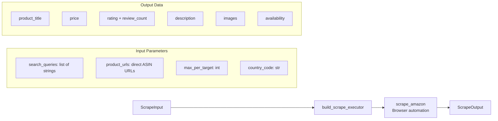

| Property | Type | Description |
|----------|------|-------------|
| Input | `search_queries`, `product_urls`, `max_per_target`, `country_code` | Search or direct URL scraping |
| Output | Product title, price, rating, reviews, description, images, availability | Structured product data |
| Rate Limit | `MAX_AMAZON_RESULTS` | Hard ceiling per invocation |
| Auth | Anonymous | No login required |

#### Google Search Scraper

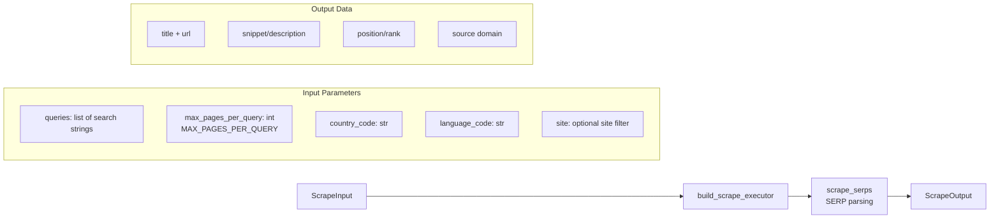

| Property | Type | Description |
|----------|------|-------------|
| Input | `queries` (list), `max_pages_per_query`, `country_code`, `language_code`, `site` | Multi-query SERP scraping |
| Output | Title, URL, snippet, rank, domain per result | Structured SERP data |
| Hard Limit | `MAX_SEARCH_QUERIES × MAX_PAGES_PER_QUERY` | Maximum SERP items per call |
| Auth | Anonymous | No login required |

#### Google Maps Scraper

| Property | Type | Description |
|----------|------|-------------|
| Input | `search_queries`, `place_urls`, `max_results` | Place search or direct URL |
| Output | Name, address, rating, reviews, phone, website, hours, category | Structured place data |
| Auth | Anonymous | No login required |

#### Indeed Scraper

| Property | Type | Description |
|----------|------|-------------|
| Input | `search_queries`, `location`, `max_per_query`, `date_posted` | Job search parameters |
| Output | Title, company, location, description, salary, date_posted, url | Structured job listings |
| Auth | Anonymous | No login required |

#### Instagram Scraper

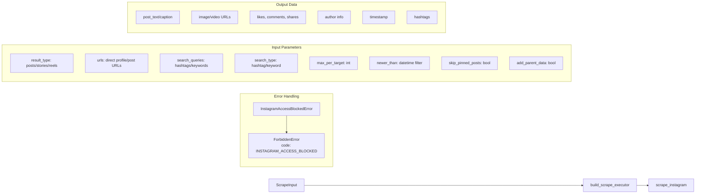

| Property | Type | Description |
|----------|------|-------------|
| Input | `result_type`, `urls`, `search_queries`, `search_type`, `max_per_target`, `newer_than`, `skip_pinned`, `add_parent_data` | Flexible scraping targets |
| Output | Caption, media URLs, engagement metrics, author info, timestamps, hashtags | Rich post data |
| Auth | Anonymous (restricted) | Keyword/hashtag search requires login → raises `ForbiddenError` |

#### Reddit Scraper

| Property | Type | Description |
|----------|------|-------------|
| Input | `search_queries`, `subreddit_urls`, `post_urls`, `max_per_target`, `sort_by`, `time_filter` | Search or direct URL |
| Output | Title, body, score, num_comments, author, subreddit, comments (nested), URL | Threaded post + comment data |
| Auth | Anonymous | Reddit API or scraping |

#### TikTok Scraper

| Property | Type | Description |
|----------|------|-------------|
| Input | `search_queries`, `profile_urls`, `video_urls`, `max_per_target`, `newer_than` | Search, profile, or direct video |
| Output | Description, video URL, likes, comments, shares, author, music, hashtags | Video metadata |
| Auth | Anonymous | Browser automation |

#### Walmart Scraper

| Property | Type | Description |
|----------|------|-------------|
| Input | `search_queries`, `product_urls`, `max_per_target` | Product search or direct URL |
| Output | Title, price, rating, review_count, description, images, availability | Product data |
| Rate Limit | `MAX_WALMART_RESULTS` | Hard ceiling per invocation |
| Auth | Anonymous | No login required |

#### YouTube Scraper

| Property | Type | Description |
|----------|------|-------------|
| Input | `search_queries`, `video_urls`, `channel_urls`, `max_per_target`, `include_transcript` | Search, video, or channel |
| Output | Title, description, transcript, views, likes, comments, duration, thumbnail | Video metadata + transcript |
| Auth | YouTube Data API or scraping | Configurable |

#### Web Crawler

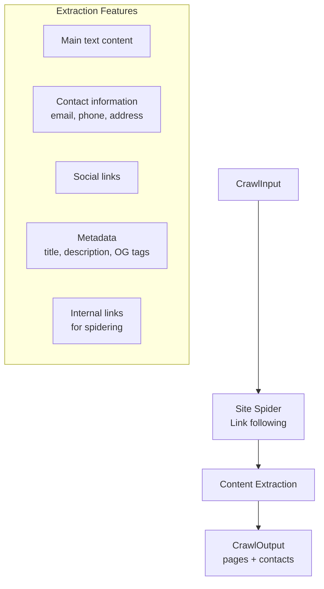

| Property | Type | Description |
|----------|------|-------------|
| Input | `url`, `max_pages`, `follow_links`, `include_contacts` | Crawl configuration |
| Output | Pages (URL, title, content, metadata), contacts (email, phone, social) | Structured site data |
| Auth | None | Direct HTTP/browser |

### 5.4 Progress Streaming (SSE)

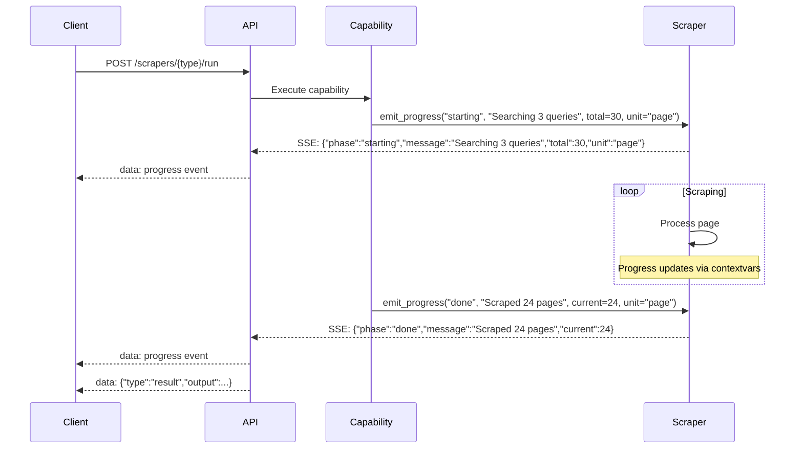

### 5.5 Run Recording

Every scraper invocation is persisted:

```python
# Recorded in `Run` table
{
    "capability_name": "google_search.scrape",
    "workspace_id": 1,
    "input_params": {...},       # JSONB
    "output_summary": {...},     # JSONB (truncated)
    "billable_units": 24,        # For billing
    "status": "success",
    "duration_ms": 3500,
    "error_message": null,
    "created_at": "2025-01-15T10:30:00Z"
}
```

---

## 6. Automation Engine

### 6.1 Architecture Overview

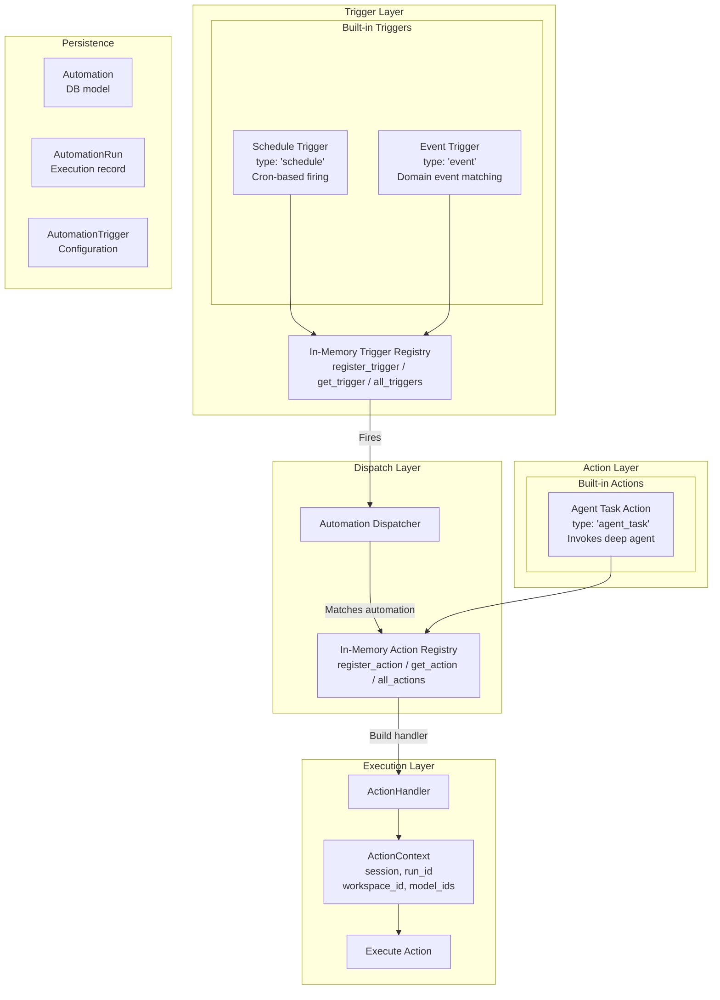

### 6.2 Agent Task Action (Deep Agent)

The primary action type invokes the full multi-agent chat system:

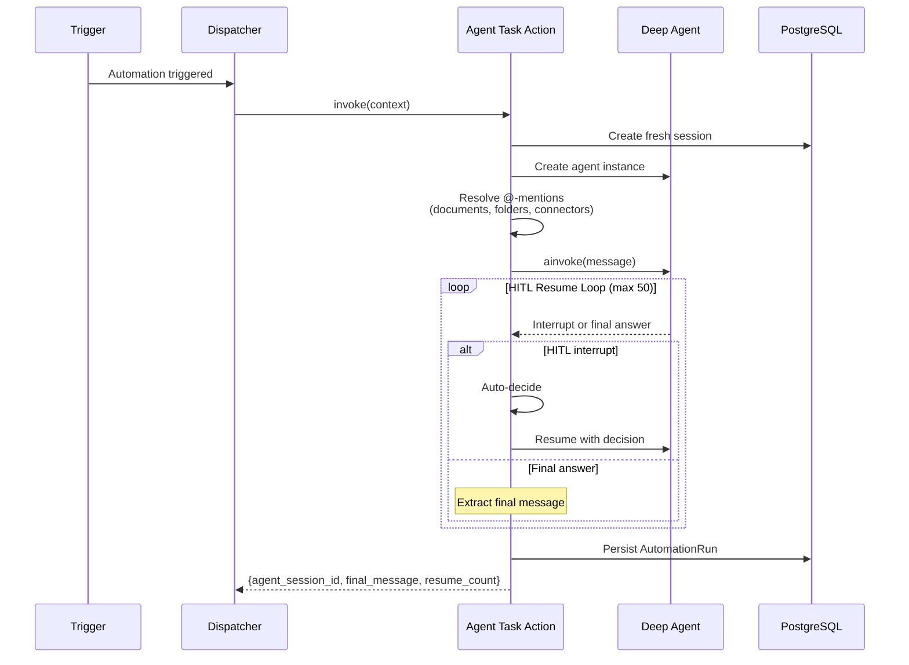

### 6.3 Trigger Definitions

| Trigger Type | Parameters | Firing Mechanism |
|-------------|-----------|-----------------|
| `schedule` | `cron_expression: str` | Celery Beat checks DB for due automations at configurable intervals |
| `event` | `event_type: str` | Fires when matching domain event is published on the event bus |

### 6.4 Automation Data Model

```python
class Automation:
    id: int
    workspace_id: int
    name: str
    description: str
    trigger_type: str              # "schedule" | "event"
    trigger_config: dict           # JSONB: cron_expression or event_type
    action_type: str               # "agent_task"
    action_config: dict            # JSONB: message template, model, etc.
    is_active: bool
    created_at: datetime
    updated_at: datetime

class AutomationRun:
    id: int
    automation_id: int
    status: str                    # "running" | "success" | "failed"
    started_at: datetime
    completed_at: datetime
    result: dict                   # JSONB: agent output
    error_message: str | None
```

---

## 7. Event Bus System

### 7.1 In-Process Pub/Sub Architecture

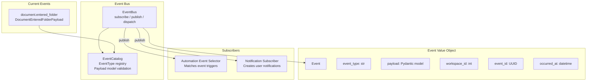

### 7.2 Event Publishing Flow

```python
# Publishing an event
await bus.publish(
    event_type="document.entered_folder",
    payload=DocumentEnteredFolderPayload(
        document_id=42,
        document_title="Research Paper",
        folder_id=5,
        folder_name="AI Research",
        is_move=False,  # True if moved from another folder
    ),
    workspace_id=1,
)

# EventBus internals:
# 1. Creates Event value object (auto UUID, timestamp)
# 2. Validates payload against catalog
# 3. Fans out to all subscribers concurrently (asyncio.gather)
# 4. Subscriber failures are logged but NOT propagated
```

---

## 8. Model Behavior Specifications

### 8.1 LLM Provider Abstraction (LiteLLM)

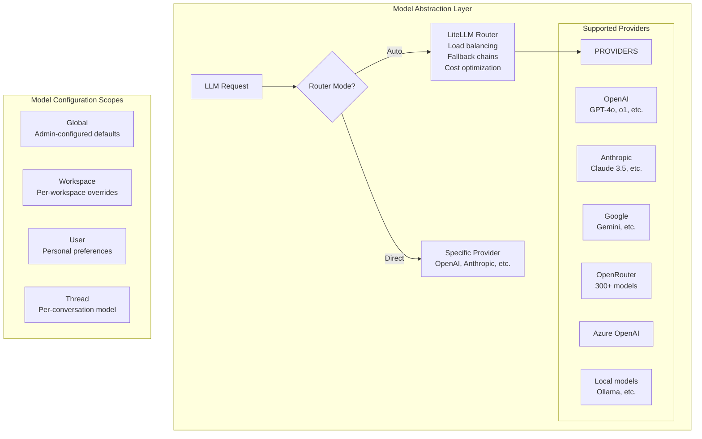

### 8.2 Model Selection Hierarchy

| Scope | Priority | Description |
|-------|----------|-------------|
| Thread | Highest | User-selected model for this conversation |
| User | Medium | User's default model preference |
| Workspace | Medium-Low | Workspace admin's configured model |
| Global | Lowest | System-wide default (admin vault) |

### 8.3 Embedding Model Configuration

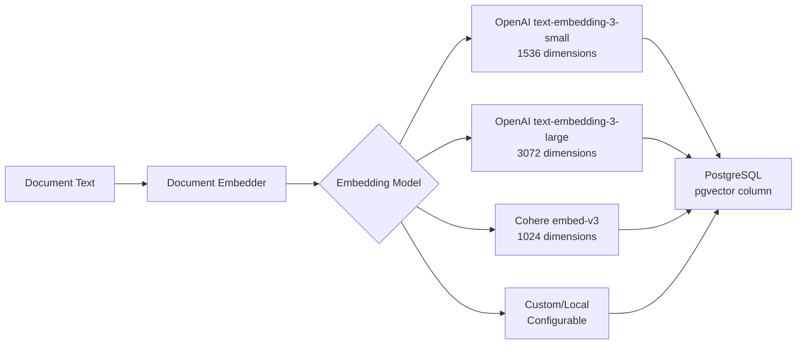

### 8.4 Vision Model Usage

Used in the ETL pipeline for image description:

```mermaid
graph LR
    IMAGE[Image from Document] --> VISION[Vision Model]
    VISION --> DESC[Text Description]
    DESC --> MERGE[Merge with Document Content]
    
    subgraph "Supported Vision Models"
        V1[GPT-4o Vision]
        V2[Claude 3.5 Vision]
        V3[Gemini Vision]
    end
```

### 8.5 TTS Model Configuration

| Service | Provider | Features |
|---------|----------|----------|
| `openai` | OpenAI TTS | Multiple voices (alloy, echo, fable, onyx, nova, shimmer) |
| `elevenlabs` | ElevenLabs | Premium voices, voice cloning |
| `local/kokoro` | Kokoro (self-hosted) | No API costs, local processing |

### 8.6 Speech-to-Text (Transcription) Behavior

Used by the ETL pipeline to turn audio and video uploads into searchable knowledge:

```mermaid
graph LR
    AUDIO[Audio File<br/>.mp3 .mp4 .m4a .wav .webm] --> STT{STT_SERVICE<br/>configuration}
    VIDEO[Video File<br/>.avi .mov .mkv .flv .wmv<br/>.3gp .ogv .m4v .mpg .vob] --> FFMPEG[parsers/video.py<br/>FFmpeg audio extract<br/>16 kHz mono WAV]
    FFMPEG --> STT
    
    STT -->|local/ prefix| LOCAL[faster-whisper<br/>stt_service.transcribe_file<br/>runs on-machine]
    STT -->|external model id| EXT[LiteLLM atranscription<br/>Whisper-compatible API<br/>STT_SERVICE_API_KEY / API_BASE]
    
    LOCAL --> MD[Markdown document<br/># Transcription of file<br/>+ transcript text]
    EXT --> MD
    MD --> IDX[Indexing Pipeline<br/>chunks + embeddings]
```

| Path | Trigger | Behavior |
|------|---------|----------|
| Local (faster-whisper) | `STT_SERVICE` starts with `local/` | `stt_service.transcribe_file()` runs a local WhisperModel - no audio leaves the machine (desktop-friendly) |
| External (LiteLLM) | `STT_SERVICE` is a model id | `litellm.atranscription(model, file, api_key, api_base?)` - OpenAI Whisper-compatible providers |
| Video pre-processing | File classified as `VIDEO` | `parsers/video.py` extracts the audio track via FFmpeg (in a worker thread), validates non-empty output, and deletes the temp WAV after transcription |

Both paths raise on empty transcriptions, so a failed or silent media file never silently produces an empty knowledge-base document. Audio and video files are parser-agnostic - the file classifier routes them to the transcription path regardless of the workspace's selected ETL service.

---

## 9. Prompt Engineering

### 9.1 Summary Generation Prompt

The system uses a comprehensive XML-structured prompt for document summarization:

```
Key Sections:
- <context>: Role definition (expert document analyst)
- <principles>: accuracy, objectivity, comprehensiveness
- <output_format>: Markdown with specific heading structure
- <validation>: Cross-reference facts, verify data points
- <length_guidelines>: 3-5 paragraphs per section, scaled to complexity
```

### 9.2 Title Generation Prompt

```
Rules:
- Title MUST be between 1 and 6 words
- Title MUST be on a single line
- No quotes, no special formatting
- Captures the essence of the user's query
```

### 9.3 System Prompt Composition

The final system prompt is dynamically composed from:

```mermaid
graph LR
    BASE[Base System Prompt<br/>Agent role + capabilities] --> CONNECTORS[Available Connectors List<br/>"You have access to: Reddit, YouTube..."]
    CONNECTORS --> DOC_TYPES[Available Document Types<br/>"Document types in workspace: ..."]
    DOC_TYPES --> MENTIONS[Mentioned Documents<br/>"@-mentioned docs with content previews"]
    MENTIONS --> CONTEXT[Corvos Context<br/>Workspace info, date, user info]
    CONTEXT --> CUSTOM[Custom Instructions<br/>User-defined agent behavior]
    CUSTOM --> FINAL[Final System Prompt]
```

### 9.4 Video Presentation Prompts

| Prompt | Purpose | Key Instructions |
|--------|---------|-----------------|
| Slide Generation | Parse source → structured slides | JSON output format, 5-10 slides, speaker transcripts |
| Theme Assignment | Assign visual themes | Select from THEME_PRESETS, dark/light mode |
| Scene Code Generation | Generate Remotion code | React component, useCurrentFrame, AbsoluteFill, animations |
| Scene Refinement | Fix syntax errors | Given error + broken code, return fixed code |

---

## 10. Tool Definitions

### 10.1 Agent Tool Registry

| Tool Category | Tool Name | Description | Input | Output |
|--------------|-----------|-------------|-------|--------|
| **Search** | knowledge_search | Hybrid search (vector + FTS) | query, top_k, filters | Ranked documents/chunks |
| **Scrapers** | google_search | Search Google | queries[], max_pages | SERP results |
| | scrape_reddit | Reddit posts/comments | queries[], subreddits | Posts + comments |
| | scrape_youtube | YouTube content | queries[], video_urls | Transcripts + metadata |
| | scrape_amazon | Amazon products | queries[], product_urls | Product data |
| | scrape_instagram | Instagram content | urls[], search_queries | Posts + media |
| | scrape_tiktok | TikTok content | urls[], queries | Videos + metadata |
| | google_maps | Places/reviews | queries[], place_urls | Place data |
| | scrape_indeed | Job listings | queries[], location | Job data |
| | scrape_walmart | Products | queries[], urls | Product data |
| | crawl_web | Web crawler | url, max_pages | Page content |
| **Documents** | create_document | Add document | type, content, metadata | Document ID |
| | update_document | Modify document | id, content | Updated document |
| | delete_document | Remove document | id | Confirmation |
| | list_documents | List docs | filters, pagination | Document list |
| **Connectors** | query_connector | Query connected source | connector_id, query | Results |
| **Generation** | generate_image | Create image | prompt, model, size | Image URL |
| | generate_report | Create report | topic, sources | Markdown report |
| | generate_podcast | Create podcast | documents | Audio URL |
| **File System** | list_files | Agent FS listing | path | File tree |
| | read_file | Read file content | path | File content |

### 10.2 Tool Error Handling

```mermaid
graph TD
    TOOL_CALL[Tool Invocation] --> TRY[Execute Tool]
    
    TRY --> |Success| RESULT[Tool Result → LLM]
    TRY --> |ToolError| USER_ERROR[User-actionable error<br/>Surfaced to model]
    TRY --> |ForbiddenError| PERMISSION[Permission denied<br/>code + message]
    TRY --> |RateLimitError| RATE[Rate limited<br/>Retry-After header]
    TRY --> |NetworkError| NETWORK[Network failure<br/>Retry with backoff]
    TRY --> |Exception| UNEXPECTED[Unexpected error<br/>Logged + generic message]
    
    USER_ERROR --> LLM[Error as tool result<br/>LLM decides next step]
    PERMISSION --> LLM
    RATE --> RETRY[Auto-retry]
    RETRY --> TRY
    NETWORK --> RETRY
    UNEXPECTED --> LLM
```

## 11. Voice Agent Behavior

> Behavioral contract for the speech-to-speech agent (`backend/app/agents/voice_agent/service.py`), its turn-taking in call mode (`web/hooks/use-voice-call.ts`), and voice/language selection across the frontend.

### 11.1 Voice Turn Pipeline Contract

Every voice turn - whether triggered by the push-to-talk mic button or the continuous phone-call mode - executes the same five-stage pipeline:

```mermaid
sequenceDiagram
    participant U as User (mic)
    participant S as VoiceAgentService
    participant STT as STT (Scribe/Whisper)
    participant LLM as Chat Agent
    participant TTS as ElevenLabs v2

    U->>S: audio bytes (+ voice_id, language hint, thread_id)
    S->>STT: transcribe(audio, language_hint)
    STT-->>S: {text, language, duration}

    alt text is empty
        S->>TTS: "I didn't catch that. Could you say something?"
        S-->>U: spoken prompt (no LLM call, metadata.empty_input=true)
    else text present
        S->>LLM: system prompt (voice-optimised + language rule) + text
        LLM-->>S: concise conversational reply
        S->>TTS: synthesise(reply, voice, language)
        TTS-->>S: MP3 bytes
        S-->>U: audio + X-Voice-Transcription + X-Voice-Reply-Text + X-Voice-Language
    end
```

Behavioral rules:

1. **Turn atomicity** - one audio upload produces exactly one spoken reply; there are no multi-step tool dialogs over voice.
2. **Empty input never reaches the LLM** - silence/noise-only recordings short-circuit to the spoken prompt "I didn't catch that. Could you say something?".
3. **Context binding** - a `VoiceAgentService` instance is bound to `workspace_id` and optionally `thread_id`, so multi-turn context persists for the conversation.
4. **Metadata transparency** - every response carries `metadata: {voice_id, tts_model, thread_id}` (plus `empty_input: true` on empty turns).
5. **Never crash the call** - all upstream failures are converted into a spoken fallback (see 11.7); the HTTP layer only returns 5xx for TTS/STT infrastructure failures.

### 11.2 Voice-Optimized Response Contract

The agent's spoken register is enforced by the system prompt in `_run_corvos_agent`:

```
You are Corvos, a helpful AI research assistant. The user is speaking to you
via voice, so keep your responses concise, conversational, and
natural-sounding. Avoid markdown formatting, bullet points, or code blocks.
Speak naturally as if in a conversation. Keep responses under 3 sentences
unless the user asks for detail.
```

Contract for every spoken reply:

| Rule | Rationale |
|------|-----------|
| ≤ 3 sentences unless the user explicitly asks for detail | Voice is serial - the user cannot skim |
| No markdown, bullet points, or code blocks | TTS reads formatting symbols aloud |
| Conversational, first-person register | Matches phone-call expectations |
| Never cite bare URLs | Spoken URLs are unusable; describe the source instead |
| Answer first, then elaborate only if asked | Turn latency dominates voice UX |

### 11.3 Language Switching Behavior

Two modes govern how the agent picks its reply language:

| Mode | Trigger | Behavior |
|------|---------|----------|
| **Auto-detect** | `language=null` (default) | Scribe detects the spoken language; the agent mirrors it in the reply; TTS renders it. Users can mix languages freely within a conversation |
| **Pinned** | `language="<code>"` from voice settings | The code is passed as the STT `language_hint` (boosts transcription accuracy) **and** appended to the system prompt as an enforcement rule |

The pinned-language prompt suffix (exact text from `service.py`):

```
IMPORTANT: Always reply in the language with BCP-47 code "<code>"
(or the language the user speaks, if it differs).
Do not switch languages unless asked.
```

Rules:

1. The agent **never** switches languages mid-conversation unless the user asks.
2. If the user speaks a different language than the pinned one, the agent follows the user's language (the "if it differs" clause).
3. 30 languages are exposed via `GET /voice/languages` (curated intersection of Scribe's ~99 and multilingual-v2's 29, plus most-requested locales). The full list: en, hi, ur, bn, pa, ta, te, mr, gu, kn, ml, es, fr, de, it, pt, ru, ja, ko, tr, id, nl, pl, uk, fa, vi, th, sv, fil, zh.
4. Language selection persists in localStorage (`voice-settings:v1`) and applies to both mic and call modes; changes take effect from the next turn.

### 11.4 Voice & Accent Selection Behavior

**Voice ID resolution order** (first match wins):

1. Per-request `voice_id` (from persisted user settings)
2. `ELEVENLABS_VOICE_ID` config
3. Hard default `pNInz6obpgDQGcFmaJgB` (Adam)

Catalog-prefixed IDs (`elevenlabs:<id>`) are transparently stripped before any ElevenLabs API call, so catalog and library voices are interchangeable everywhere.

**Two voice sources:**

| Source | Contents | Selection behavior |
|--------|----------|--------------------|
| Default catalog (`GET /voice/voices`) | 15 built-in voices (10 multilingual, 5 English-optimised) | Preview synthesised on demand via `POST /voice/tts`, cached per page lifetime |
| Voice Library (`GET /voice/library`) | The account's ElevenLabs library - community voices carrying **accent labels** (indian, pakistani, chinese, american, british, …) | Grouped by accent in the settings UI, searchable, free hosted preview MP3 per voice; any voice added to the ElevenLabs account appears automatically |

Rules:

1. The selected voice (ID + display name) persists per browser in `voice-settings:v1` via `atomWithStorage`.
2. Voice changes never interrupt an in-flight turn - the `optsRef` pattern applies settings from the next turn.
3. Accent only changes **how** the agent sounds; language selection governs **what** language it speaks. They are independent knobs.

### 11.5 Call Mode Turn-Taking Behavior

The continuous phone-call mode (`use-voice-call.ts`) implements hands-free turn detection on the client:

```mermaid
stateDiagram-v2
    [*] --> Listening
    Listening --> Speaking : RMS > 0.015
    Speaking --> Processing : 1.5 s continuous silence
    Listening --> Processing : Send-now pressed
    Processing --> AgentSpeaking : reply audio ready
    AgentSpeaking --> Listening : audio ended → re-open mic (auto-loop)
    Processing --> Listening : turn failed (toast, stay in call)
    Listening --> Paused : mute
    Paused --> Listening : unmute
```

Turn-taking rules:

1. **Silence = end of turn** - 1.5 s of continuous sub-threshold volume after speech auto-sends the clip; no button press required.
2. **Noise floor rejection** - clips shorter than 400 ms are discarded (mic pops, coughs, ambient noise).
3. **Auto-loop** - after the reply's `onended`, the mic re-opens after a 200 ms settle delay; the user can speak immediately.
4. **Mute discards** - muting stops and throws away the in-progress recording and playback; unmuting resumes listening. Nothing recorded while muted is ever transmitted.
5. **Send-now override** - force-ends the listening phase and ships the current buffer immediately.
6. **Errors never drop the call** - a failed turn surfaces a toast and re-opens the mic; only the hang-up button ends the session.
7. **Clean teardown** - hang-up aborts the in-flight request (AbortController), stops the recorder, pauses playback, releases the MediaStream, and closes the AudioContext.
8. **Persistent stream** - the MediaStream and AudioContext stay alive across turns; a fresh MediaRecorder is created per turn.

### 11.6 Voice API Behavior Contract

All endpoints require auth (`AuthContext = Depends(get_auth_context)`); mounted under `/api/v1/voice`.

| Endpoint | Method | Input | Success output | Error behavior |
|----------|--------|-------|----------------|----------------|
| `/voice/agent` | POST | multipart: audio + workspace_id + thread_id? + voice_id? + language? | `audio/mpeg` bytes + `X-Voice-Transcription` / `X-Voice-Reply-Text` / `X-Voice-Language` headers | 400 "No audio data received" / 400 on invalid input / 500 "Voice agent processing failed. Please try again." |
| `/voice/tts` | POST | JSON: text, voice_id? | `audio/mpeg` attachment (`speech.mp3`) | 400 "Text cannot be empty" / 500 "Text-to-speech failed" |
| `/voice/stt` | POST | multipart: audio | JSON: `{text, language, duration_seconds}` | 400 "No audio data received" / 500 "Speech-to-text failed" |
| `/voice/voices` | GET | - | Built-in catalog voices (id, name, gender, language) | - |
| `/voice/library` | GET | - | Account voice library with accent labels (id, name, accent, language, gender, preview_url) | - |
| `/voice/languages` | GET | - | 30 curated `{code, name, native_name, flag}` entries | - |

### 11.7 Failure & Degradation Behavior

| Failure | System behavior | User hears |
|---------|-----------------|------------|
| Empty/noise-only transcription | Short-circuits before the LLM; `metadata.empty_input=true` | "I didn't catch that. Could you say something?" |
| No LLM configured for workspace | Detected at `_run_corvos_agent` | "I'm sorry, no AI model is configured for this workspace. Please ask an administrator to set up an LLM connection." |
| Chat agent exception | Logged, converted to spoken fallback | "I'm having trouble processing that right now. Could you try again?" |
| ElevenLabs Conversational AI fails or SDK missing | Falls back to the Corvos agent transparently | Normal Corvos reply |
| Conversational AI returns empty reply | Guarded by `.strip()` check | "I couldn't process that request." |
| STT/TTS infrastructure failure | HTTP 4xx/5xx to client; call mode shows toast and re-opens mic | (no audio - call continues) |

Degradation order: ElevenLabs Conversational AI → Corvos multi-agent chat → spoken fallback message. The pipeline always returns audio for any turn that reached STT successfully.

---

*This specification defines the complete behavioral contract for all AI agents, scraper systems, and model interactions in the Corvos platform.*
